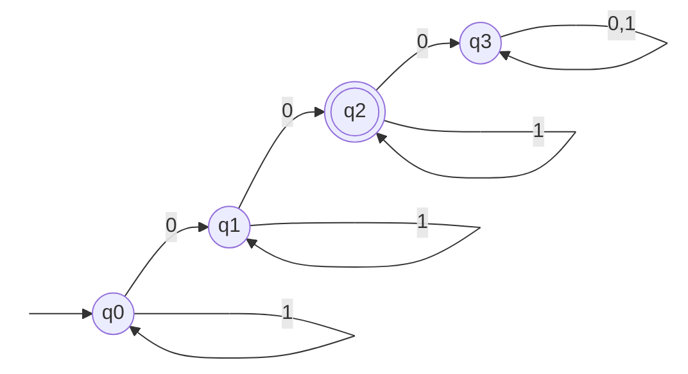
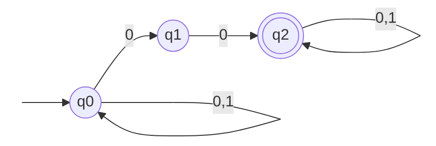

## 基本事項

- アルファベット ... 記号の有限集合
- 語(記号列) ... アルファベット$\Sigma$上の記号からなる記号列
  - 空記号列 ... 長さが 0 の記号列
- 言語 ... アルファベット$\Sigma$上の語の集合

- べき乗集合 ... A の部分集合全体からなる集合 \

  $$
    \begin{aligned}
      A &= \{a,b,c\} \\
      2^A &= \{\varnothing,\{a\},\{b\},\{c\},\{a,b\},\{b,c\},\{a,c\},\{a,b,c\}\} \\
      |A| &= n \Rightarrow |2^A| = 2^n
    \end{aligned}
  $$

- クリーネ閉包 ... $\Sigma$に含まれる 0 個以上の文字列を連結して作ることができる文字列の集合 \
  $$
    \begin{aligned}
      \Sigma &= \{xx\} \\
      \Sigma^* &= \{\varnothing,xx,xxxx,...\}
    \end{aligned}
  $$

### 同値関係

$x$と$y$の関係性を$xRy$と書く \
集合 X 上の関係 R が同値関係を満たすためには 3 つの条件が必要($a,b,c \in X$)

- 反射的 $aRa$
- 対称的 $aRb \Rightarrow bRa$
- 推移的 $aRb \land bRc \Rightarrow aRc$

## DFA の基礎

$A= \langle Q,\Sigma,\delta,q_0,F \rangle$

- $Q$ ... 状態の有限集合
- $\Sigma$ ... 入力記号の有限集合
- $\delta$ ... 動作関数 $Q \times \Sigma = Q$
- $q_0$ ... 初期状態($\in Q$)
- $F$ ... 受理状態($\subseteq Q$)

具体例

ちょうど2個の0を含む語からなる言語

$$
  \begin{matrix*}[l]
    A = \langle Q,\Sigma,\delta,q_0,F \rangle \\
    \text{where } Q = \{q_0,q_1,q_2,q_3\} \\
    \Sigma = \{0,1\} \\
    \delta(q_0, 0) = q_1, \delta(q_0, 1) = q_0, \\
    \delta(q_1, 0) = q_2, \delta(q_1, 1) = q_1, \\
    \delta(q_2, 0) = q_3, \delta(q_2, 1) = q_2, \\
    \delta(q_3, 0) = q_3, \delta(q_3, 1) = q_3, \\
    F = \{q2\}
  \end{matrix*}
$$

## NFA の基礎

$A= \langle Q,\Sigma,\delta,q_0,F \rangle$

- $Q$ ... 状態の有限集合
- $\Sigma$ ... 入力記号の有限集合
- $\delta$ ... 動作関数 $Q \times \Sigma = 2^Q$
- $q_0$ ... 初期状態($\in Q$)
- $F$ ... 受理状態($\subseteq Q$)

**DFA との違い**

NFA は 0 個を含め複数の状態に遷移できる

具体例

2個の連続した0を含む語全体からなる言語

### 空動作付き NFA

$\epsilon$ -NFA は $\delta(q,\epsilon)$ となる動作(=空動作, $\epsilon$ 動作)がある非決定性オートマトン

動作関数は $Q \times (\Sigma \cup \{\epsilon\}) \rightarrow 2^Q$

定義より非決定性は $\epsilon$ 動作のある非決定性の一部
