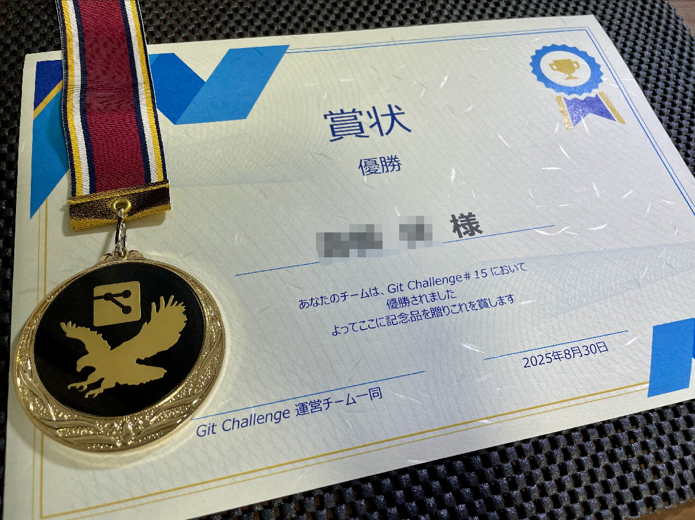

こんにちは。株式会社MIXIさんが開催している[Git Challenge #15](https://mixi-recruit.snar.jp/jobboard/detail.aspx?id=r2gJYJt_Ad7XK032Cxq8RA)に参加させていただいたので、その参加記を書きます。

Git Challengeとは「gitリポジトリに設けられた難題をチームワークで解決していく競技型技術イベント」[^gitchall]であり、2名チームで出題された複数の問題を制限時間以内に解き、獲得ポイントをチームごとに競います。

[^gitchall]: https://github.com/mixi-git-challenge/publications より引用

## 当日までにしたこと

MIXIの新卒研修として公開されているGit研修資料を読みました。

https://speakerdeck.com/mixi_engineers/2025_new_grad_training_git_basic

また色々な方が公開されている過去の参加記を読み雰囲気を掴むとともに、公開されている過去問題を見てみました。

https://github.com/mixi-git-challenge/git-challenge-is-order-an-adding

https://github.com/mixi-git-challenge/git-challenge-minesweeper

## 始まるまで

10時40分集合だったので、25分くらいに渋谷駅に着くように出発しました。渋谷は人混みがすごいので揉まれながら何とか到着。オフィスの入口が分からず少し迷ってしまいました。  
建物に入るとエレベーターがすごく広くて驚きました。オフィスも非常に綺麗で、さすがスクランブルスクエアという感じでした。

到着すると机の上にはステッカーとロゴの入ったプリングルズが置いてありました。[^nophoto]

[^nophoto]: 写真は撮り忘れてしまいました

会場には10チームあり、その中でfoxtrotチームに配属されました。始まるまでは初めて会ったペアの人と談笑していました。どちらも普段gitを使うぐらいなので、善戦できればいいねーという話をしていました。

## 午前

<blockquote class="twitter-tweet">
本日は Git Challenge＃15 です🎉 午前は、キーノートとチュートリアルから！ 午後から本格的に競技開始です！ 皆さんで楽しみましょう！！よろしくお願いします✨<a href="https://twitter.com/hashtag/MIXI_Git?src=hash&amp;ref_src=twsrc%5Etfw">#MIXI_Git</a> <a href="https://t.co/KJ8c3dmNTi">pic.twitter.com/KJ8c3dmNTi</a>
&mdash; MIXI 新卒採用公式アカウント (@HR_mixi) <a href="https://twitter.com/HR_mixi/status/1961616918441594891?ref_src=twsrc%5Etfw">August 30, 2025</a></blockquote> 

午前中は社員さんによるキーノートと競技のチュートリアルがありました。

キーノートでは`git worktree`の紹介があり、初めて知った機能でしたが結構活用できそうで勉強になりました。複数のブランチを同時に扱えるのは便利だなと思いました。

チュートリアルでは問題の解答方法の説明がありました。[^tutorial]
問題の解答はリモートへのpushによって行い、自動でCIが回って正解/不正解の判定が行われ、それがスコアボードシステムにリアルタイムで反映されました。内部の仕組みを聞きたかったのですがタイミングを逃してしまいました。

[^tutorial]: 参考: https://github.com/mixi-git-challenge/git-challenge-tutorial

## ランチ会

綺麗なオフィスでのランチ会でした。飲み物とお弁当が配られ、お弁当は種類を選べたので牛タン弁当を選びました。

座席は参加者5人あたり社員さん2人くらいの配置でインターンや就活事情について話しながら食べました。めっちゃ美味しかったです。同年代のエンジニア志望の人たちと交流できる貴重な機会でもありました。関西から来てる人もいてすごいの気持ちになりました。

## 午後

ランチが終わったら早速競技開始です。問題の詳細については述べることができませんが、とった戦略について話します。

キュー形式で簡単な問題から解いていき、解き終わったら次の問題、わからなかったら飛ばすという戦略を取りました。幸い分からないという問題はなく、比較的順調に前から解き進めることができ、★9の問題を除く全てを完答することができました。そして最終的には全体で1位のスコアを取ることができました。

")

競技時間3時間中、半分の１時間半で★3までの問題を解くことができ、残りは自分が★10を相方が★8を解いて終了となりました。特に終了3分前に★10を解くことができ、ギリギリで2位から逆転することができました。社員の方も「ドラマが起きた」とざわざわしていました。

久しぶりに物事に熱中して疲れでいっぱいでした。  
終了後は社員さんによる分からない問題の解説がありました。自分の担当じゃない問題などの解説があり面白かったです。Gitの奥深さを改めて感じました。

## 懇親会

場所を移動して懇親会が開かれました。まずは表彰ということで賞状とメダルをいただけました。

その後は全員で乾杯をして、食事をしながら他のチームの感想や技術談義、就活の話などができました。社員の方々やFFの人とも話せてよかったです。

<blockquote class="twitter-tweet">
<a href="https://twitter.com/hashtag/MIXI_Git?src=hash&amp;ref_src=twsrc%5Etfw">#MIXI_Git</a> 後半は激闘でした…！！ 追い抜き追い抜かれ…ラスト3分で勝負を制したのは 『Foxtrotチームでした』🎊✨  イベント後は、皆で仲良く懇親会です！！ 皆さんお疲れ様でした～！！楽しんでください！<a href="https://twitter.com/hashtag/%E3%82%A8%E3%83%B3%E3%82%B8%E3%83%8B%E3%82%A2?src=hash&amp;ref_src=twsrc%5Etfw">#エンジニア</a> <a href="https://t.co/bhGTmhDWnU">pic.twitter.com/bhGTmhDWnU</a>
&mdash; MIXI 新卒採用公式アカウント (@HR_mixi) <a href="https://twitter.com/HR_mixi/status/1961739052920741976?ref_src=twsrc%5Etfw">August 30, 2025</a></blockquote>

## 感想

### 競技に関して

主にコンフリクトを解決する系とgitの内部構造をいじくる系の問題があり、それにうまく戦略がマッチして前者を自分が後者を相方が担当できたので効率的に解くことができました。なのでもう一方の問題は復習したいと思います。

また相方が話しかけやすい人でコミュニケーションを密に取ることができ、いい感じに連携できました。ペアプログラミングの良さを実感する場面でもありました。  
これだけ解けたのは過去1、2チームという話もあり、★10を解けて非常によかったです。変[^hen]な問題に対応するCTF力も役に立ったかもしれません。

[^hen]: 複雑で面白おかしいの意

### 学んだこと

今回、競技中も含めて新しくgitのサブコマンドを知ったり、いろいろな知識や交友を得られました。特に`git worktree`のような実用的な機能を知れたのは大きな収穫でした。  
また同年代のエンジニア志望の人たちとの交流も非常に有意義でした。普段なかなかこういった機会がないので、技術的な話から就活の話まで幅広く話せて楽しかったです。  
MIXIの社員さんとも直接お話でき、企業の文化や技術的な取り組みについても知ることができました。

## おわり

Gitの奥深さを改めて感じるとともに、チームで問題解決に取り組む楽しさを実感できた素晴らしいイベントでした。主催してくださったMIXIの皆様、一緒に頑張ったペアの方、参加者の皆様、本当にありがとうございました。

他にもBug Shooting ChallengeやTDD Challenge[^tdd]というものもあるらしいので挑戦してみたいです。

[^tdd]: テスト駆動開発。一体どんなことをやるんだといった感じ
