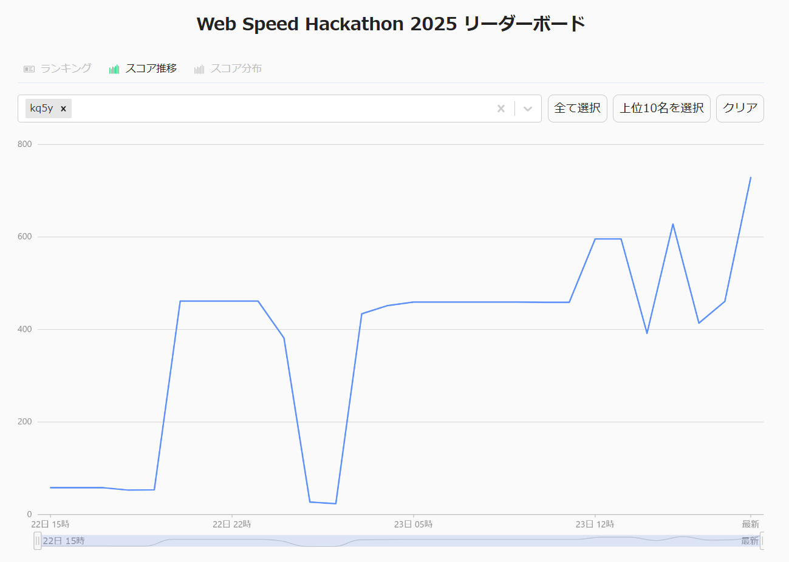

こんにちは。Cyber Agentさんが開催している[Web Speed Hackathon 2025](https://cyberagent.connpass.com/event/338797/)に初めて参加させていただいたので、その感想とやらを書き連ねます。

Web Speed Hackathonとは「予め準備してあるWebアプリケーションのパフォーマンスを改善することで競い合うハッカソン」[^wsh]であり、めちゃくちゃ重たいWebアプリケーションのチューニングをし、どこまで軽くできるかを競うイベントです。スコアは各ページのLighthouseのスコアと決められたフローのスコアを合計し計算します[^score]。今回の題材は「架空の動画配信サービス」ということで自分にとっては比較的馴染みの深い題材でした。

[^wsh]: https://cyberagent.connpass.com/event/338797/ より引用
[^score]: 詳しくは[docs/scoring.md](https://github.com/kq5y/web-speed-hackathon-2025/blob/develop/docs/scoring.md)

参加時のリポジトリ

https://github.com/kq5y/web-speed-hackathon-2025

初めての参加でしたが順調にスコアが上がっていき、最終的にスコア単体では１位だったもののレギュレーション違反により失格になってしまいました。というかそもそもレギュレーションチェックを受けた上位陣はほとんど失格し残った一人の方が新たな１位になるという...
もう少しで１位になれた悔しさを供養するためにもここでやったことを振り返っていきます。

## やったこと

時系列順でコミットログを抜粋します

### １日目

webpack-bundle-analyzerを使用してファイルを見てみると、100MB以上あったのでいらないところを削っていく事から始めていきました。

- [e133138](https://github.com/kq5y/web-speed-hackathon-2025/commit/e133138edcf3221e0657191c86b17d215fdde7f3) `lodash`を置き換え
- [b2a6bad](https://github.com/kq5y/web-speed-hackathon-2025/commit/b2a6bad3bee248de06855e432adc0945de334535) iconを全て読み込んでいたため、`@iconify/react`に変更
- [86438d8](https://github.com/kq5y/web-speed-hackathon-2025/commit/86438d84f40397165519e5cfa00cada4d99a4ca7) 画像のpreloadとHydrationDataを削除、SSRからSPAへ
- [6743232](https://github.com/kq5y/web-speed-hackathon-2025/commit/6743232feb87cfd89aae48f7e1fd659a32da14f0) JPEGのサムネ画像をAVIFに置き換え
- [f71a019](https://github.com/kq5y/web-speed-hackathon-2025/commit/f71a0191436ed6b7909dff0732069a6cffdcf3b1) `p-min-delay`の削除
- [4be745d](https://github.com/kq5y/web-speed-hackathon-2025/commit/4be745d94f187418f79e7f8220b1a987226adb2e) SVGのロゴもAVIFに置き換え
- [ea780db](https://github.com/kq5y/web-speed-hackathon-2025/commit/ea780db57058a95eedc64d55303f909b5deb7576) 番組表のチャンネルロゴをPNGに置き換え \
  SVGにfont情報がbase64で埋め込まれていて既存ツールでの変換ができなかったため、Playwrightでスクショを撮る[スクリプト](https://github.com/kq5y/web-speed-hackathon-2025/blob/develop/scripts/svg_to_png.py)を作成。
- [445eca0](https://github.com/kq5y/web-speed-hackathon-2025/commit/445eca0ad9d3a53a7813b65a79476f40fd82f3c7) 適当にimg要素に`loading="lazy"`を追加
- [592b3fc](https://github.com/kq5y/web-speed-hackathon-2025/commit/592b3fc08fc62b35b2e5474e1cdf354b29e51e76) 不必要なpolyfillを削除

今回の公式デプロイ環境はherokuでしたが、privateにできないなど色々問題がありそうだったので、去年と同様の koyebで始めました。

**計測 58.25 / 1200.00**

- [962a3d7](https://github.com/kq5y/web-speed-hackathon-2025/commit/962a3d79e62e26616db088fa153b09ac0029ed8a) 番組表の説明画像をpublicに移動し、AVIFに置き換え
- [7d21b0d](https://github.com/kq5y/web-speed-hackathon-2025/commit/7d21b0dff59a99ca93ae91364cf506c21e69b939) 404ページのGIFを圧縮
- [1a4c4b9](https://github.com/kq5y/web-speed-hackathon-2025/commit/1a4c4b9602ff160bdc62294bc1dd54f5e5b07810) ReDOSを修正
- [47a0fb6](https://github.com/kq5y/web-speed-hackathon-2025/commit/47a0fb61a78493463f040ad53729a9ac473137fc) WebpackからViteへ移行
  Webpackでのチャンク分割がうまくできず、ビルドも遅かったためわかりやすいViteに移行。
- [5b5b201](https://github.com/kq5y/web-speed-hackathon-2025/commit/5b5b201370aa04aa5a6ae327d2d31d629edcecf6) `hls.js`と`video.js`を削除し`shaka-player`に統一
  全部を試してみて、一番バンドルサイズが小さくなった`shaka-player`を採用。
- [fbc5816](https://github.com/kq5y/web-speed-hackathon-2025/commit/fbc58162bde692f6e287244b038c919479a2b5d6) DialogでHeadless UIの全てをimportしていたのを修正
- [391430d](https://github.com/kq5y/web-speed-hackathon-2025/commit/391430df98a97d42459d37d252e9604122a03dbc) シークプレビューの画像を生成済みのものに変更。ffmpegとかを削除
  これでバンドルからwasmも消せてサイズ大幅削減に。

**計測 52.95 / 1200.00**

- [71e4dd7](https://github.com/kq5y/web-speed-hackathon-2025/commit/71e4dd7e13c0313dbb1fecc0ed71325305ee9e4f) `react-use`を置き換え

**計測 53.50 / 1200.00**

- [8ae02d6](https://github.com/kq5y/web-speed-hackathon-2025/commit/8ae02d6506ba6f7126364bd482ffccec980cb3ef) サムネイルURLからversionを削除 \
  ここで乱数が狂い、「表示されるコンテンツがオリジナルのものと異な」[^difforigin]ってしまう現象が発生
- [b9198cc](https://github.com/kq5y/web-speed-hackathon-2025/commit/b9198cc986664eb290ff71017370d73a665e9c43) `createPlayer`のdynamic importを修正

[^difforigin]: Discordサーバーの違反理由より

ここから乱数のズレにより、テストの対象idが存在しなくなってしまうせいか視聴ページなどが上振れするため嘘スコアになります。

**計測 461.50 / 1200.00 (嘘)**

本人はまさかの暫定２位に驚いていました。

<blockquote class="twitter-tweet" data-lang="ja">
？？？ &quot;Web Speed Hackathon 2025&quot; に挑戦中です！ スコア 461.50 / 1200.00 で、現在 2 位です <a href="https://t.co/t4CXqwwp99">https://t.co/t4CXqwwp99</a> <a href="https://x.com/hashtag/WebSpeedHackathon?src=hash&amp;ref_src=twsrc%5Etfw">#WebSpeedHackathon</a>
&mdash; kasi (@kq5y__) <a href="https://x.com/kq5y__/status/1903413236080226597?ref_src=twsrc%5Etfw">2025年3月22日</a></blockquote>

- [8a37616](https://github.com/kq5y/web-speed-hackathon-2025/commit/8a37616ba656065718f390fc7bdb50d735a049a3) 各要素のdescriptionが全て5000文字ほどあるが、表示するのは200文字程度なので、いらないdescriptionは消し必要なのは短縮することで、レコメンドAPIのレスポンスを小さく
- [6128282](https://github.com/kq5y/web-speed-hackathon-2025/commit/6128282481899e0b295dd5114cd6dbf8258a7949) 404ページのレコメンドAPIを更に小さく
- [5f9dccb](https://github.com/kq5y/web-speed-hackathon-2025/commit/5f9dccb19782e97d6c5227b30e1aebfb4e8a8fd3) `Hoverable`をCSSに置き換え
- [a0b65be](https://github.com/kq5y/web-speed-hackathon-2025/commit/a0b65beb2d6368256ae94d6698398be0843e07a1) シーク処理を置き換えてポインター関連を削除 **<- ここで悲劇**{#higeki}
- [a5e7214](https://github.com/kq5y/web-speed-hackathon-2025/commit/a5e7214697ca8381d4e4a787574eda5fe4c645f5) `Ellipsis`を`line-clamp`に置き換え
- [9197f7d](https://github.com/kq5y/web-speed-hackathon-2025/commit/9197f7d21f2c1ffa4734b8732154e8ecd2fded98) `AspectRatio`をCSSに置き換え

**計測 381.60 / 1200.00 (嘘)**

ここらへんでログインモーダルがおかしくなっていてフォーカスすると固まるため、hydrateRootの引数などを修正してみたりしています。

- [3b4da63](https://github.com/kq5y/web-speed-hackathon-2025/commit/3b4da63cfb07f20f3c21980428caa16c695e0524) `Dialog`の中身部分を別コンポネントに分離
- [4f652ee](https://github.com/kq5y/web-speed-hackathon-2025/commit/4f652ee89465ee91e3af2f91646fe325db77b919) レコメンドAPIでentrance以外は`limit:1`に

**計測 25.85 / 1200.00 (嘘)**

`NO_FCP`が大量発生し何故かスコアが一気に低迷しました。おそらくhydrateRootとか起因？

- [87e6992](https://github.com/kq5y/web-speed-hackathon-2025/commit/87e6992c69d7aedcf8de6c58ac6d66c247cbd0bf) `postTask`のdelayを削除
- [ddb7ed1](https://github.com/kq5y/web-speed-hackathon-2025/commit/ddb7ed18976d0382989a1418b1680c5ccc98adeb) `@fastify/compress`を適用

**計測 27.05 / 1200.00 (嘘)**

- [5d9e76c](https://github.com/kq5y/web-speed-hackathon-2025/commit/5d9e76c564b7270cc845bb10513fc4325674b003) playlistの`X-AREMA-INTERNAL`を削除
- [5b5110f](https://github.com/kq5y/web-speed-hackathon-2025/commit/5b5110f2e6bd07c1491f7c3bb818a76657e5a432) `bufferingGoal`を50から20に変更

ここでkoyebが遅いのかと思い、Cloudflare Tunnelを用いて自身のPCから配信する形に変更

**計測 23.55 / 1200.00 (嘘)**

- [2bbda0a](https://github.com/kq5y/web-speed-hackathon-2025/commit/2bbda0a124f66efd677351c9d08b0372c1e6e699) hydrateRootの引数を変更
- [a3e9003](https://github.com/kq5y/web-speed-hackathon-2025/commit/a3e90036f05c07682389f3d435e39c4a9ae207fd) `no-cache`を削除
- [76716ed](https://github.com/kq5y/web-speed-hackathon-2025/commit/76716edcf186893d5cb80afa1831698d6e7e3a1f) プレイヤーに`preload: "metadata"`を追加

**計測 434.00 / 1200.00 (嘘)**

- [1baa8a6](https://github.com/kq5y/web-speed-hackathon-2025/commit/1baa8a6a7dc98b6ecdf8ef81ada99f0bb2d7c60b) `aspect-video`を追加

**計測 451.70 / 1200.00 (嘘)**

- [4e0ac9b](https://github.com/kq5y/web-speed-hackathon-2025/commit/4e0ac9ba37ec3eb19aebfd4428a81367f75a93f0) `@sinclair/typebox`, `@sinclair/typemap`を削除
- [222f0ee](https://github.com/kq5y/web-speed-hackathon-2025/commit/222f0eea730ef3714d280787e3b4585b1a6d3331) `@iconify/react`をSVGへ置き換え

**計測 459.25 / 1200.00 (嘘)**

眠くなったのでベッドイン。UnoCSSのドキュメントを見ながら就寝。１日目の稼働時間は03/22 10:30から03/23 05:30でした。

### ２日目

顔を洗って、アセットを複数種類作るのとUnoCSSの調整をした後、APIの調整とフローを通すことを目標に２日目開始。

- [f365ebf](https://github.com/kq5y/web-speed-hackathon-2025/commit/f365ebfba82941b9db3ebea3ae2611a3e2dc8d4c) サムネイル画像をsmall/bigの２種類に
- [746f6e0](https://github.com/kq5y/web-speed-hackathon-2025/commit/746f6e06e455ad7d57a0c2694ff6cc0a41e56c28) トップページのpreview用の動画を生成
  tsファイルのサイズを小さくする[スクリプト](https://github.com/kq5y/web-speed-hackathon-2025/blob/develop/scripts/video_convert.py)を作成

**計測 458.75 / 1200.00 (嘘)**

- [4fe9721](https://github.com/kq5y/web-speed-hackathon-2025/commit/4fe9721e91c44f228b3600f81778abbe51215638) UnoCSSを静的生成へ
- [d005a24](https://github.com/kq5y/web-speed-hackathon-2025/commit/d005a247072add836d066e9f29852ba4441f5ce1) 一部のimgを`eager`に

**計測 595.65 / 1200.00 (嘘)**

フローを成功させるために、aria-labelをつけてみたり[^arialabel]いろいろしてみた。

[^arialabel]: 効果は不明 https://qiita.com/thithi7110/items/b42025e78cb64455ba9b

- [351e07d](https://github.com/kq5y/web-speed-hackathon-2025/commit/351e07d7b27fec2780174372613dab94428444d9) `react-final-form`を削除
- [3814c7c](https://github.com/kq5y/web-speed-hackathon-2025/commit/3814c7c3272f0810d4d867d0574833f0cac725a0) 乱数のズレ問題を解決

**計測 239.65 / 1200.00 (ここから本当)**

おまけにここからフローで得点がつくようになった

- [a15cda1](https://github.com/kq5y/web-speed-hackathon-2025/commit/a15cda1b401c3ca4bf30030a20e6e29a5ec02bcf), [0e524ef](https://github.com/kq5y/web-speed-hackathon-2025/commit/0e524efd94a0b994182a3d9c7ec5a9304dcb04f5), [c6d9bbf](https://github.com/kq5y/web-speed-hackathon-2025/commit/c6d9bbfbb92ed194ffae4501d3e548506c070458), [8c84273](https://github.com/kq5y/web-speed-hackathon-2025/commit/8c84273fd44316d62ada7e2c85b5d163c80c87cc) 各ページでファーストビューに含まれる画像を`eager`に

**計測 376.22 / 1200.00**

**計測 391.86 / 1200.00**

何回か試しても番組表のフローで`PROTOCOL_TIMEOUT`が発生。調べてみても謎だ...

- [062deaf](https://github.com/kq5y/web-speed-hackathon-2025/commit/062deaf57a6fdda3b966cbb200c9c2cfa4e2e0be) データベースの同期間隔を1000msから5000msに変更
- [7ace806](https://github.com/kq5y/web-speed-hackathon-2025/commit/7ace80643a9b6431121cb777bf9f008a11535f40) データベースにインデックスを追加[^index]

[^index]: やり方があっているかわからないし、効果も軽微

**計測 380.08 / 1200.00**

- [6e54597](https://github.com/kq5y/web-speed-hackathon-2025/commit/6e5459762e2a28460cdbecb25c996247dda44fbe) polyfillのsetimmediate削除 (悲劇の弊害)

**計測 319.23 / 1200.00**

回線速度などでランダム性が出るため[^unext]、ここからkoyebに戻る

[^unext]: ここで家族がドラマを見始めたため帯域を圧迫

**計測 413.86 / 1200.00**

残り２時間を切ったのでレギュレーションチェックを実施。[テストケース](https://github.com/kq5y/web-speed-hackathon-2025/blob/develop/docs/test_cases.md)の<u>大丈夫でなさそうなところを</u>手元で確認する。\
そこで１時間延長のお知らせ[^heroku]。ラッキーと思い各ページの調整を行う。

[^heroku]: Heroku 関係でたくさん不具合が起きていたらしく、それ以外を選択して正解だった。

- [3e47488](https://github.com/kq5y/web-speed-hackathon-2025/commit/3e47488e30b7c701b7f901e51042e18d57d75fd1) episodeページの調整。画面下部のレコメンドAPIのリクエストをページ読み込み後にしたり、コンポネント分割、その他CSSの調整。
- [9eab063](https://github.com/kq5y/web-speed-hackathon-2025/commit/9eab06384ccafd303232a2812e253c1782a6eab3) 404ページの調整。`useLoaderData`を使ったり
- [708edc7](https://github.com/kq5y/web-speed-hackathon-2025/commit/708edc7af4d2d40aed103b2b82ab58ed2f38f443) homeページの調整。上と同じく。
- [e2d6557](https://github.com/kq5y/web-speed-hackathon-2025/commit/e2d65575fe204e61f3ab4da1be98f7e43c243ac1) episode, programページの調整。上と同様にprefetchやコンポネントの調整
- [a3c48de](https://github.com/kq5y/web-speed-hackathon-2025/commit/a3c48de830bc84dfb05d8a92d628a0668571eb0e) seriesページの調整。上と同じく。

**計測 460.67 / 1200.00**

- [8dc6256](https://github.com/kq5y/web-speed-hackathon-2025/commit/8dc6256664decbc7b996b32a8aca26bde2b1361b) 次の番組を取得するAPIを作成。programページで都度timelineを取得していたためそれを置き換え。
- [7bc4a81](https://github.com/kq5y/web-speed-hackathon-2025/commit/7bc4a81705ffb5a4ad23da0bb011e2eec2f3031d) 番組の詳細を取得するAPIを作成。番組表ページの読み込み時に呼ばれるAPIのサイズを小さくし、dialogを開く際に追加で情報を取得する。
- [4fb56b1](https://github.com/kq5y/web-speed-hackathon-2025/commit/4fb56b101691bfc2f09ac785ca10f91ae1bfdda1) その他のAPIにおいても、descriptionがとても長いため最初の300文字を抜粋する処理を適応。

**計測 728.49 / 1200.00**

最後の`/retry`、まさかの暫定１位に心臓バクバクです。

<blockquote class="twitter-tweet">
レギュ落ちしなければー &quot;Web Speed Hackathon 2025&quot; に挑戦中です！ スコア 728.49 / 1200.00 で、現在 1 位です <a href="https://t.co/t4CXqwwp99">https://t.co/t4CXqwwp99</a> <a href="https://x.com/hashtag/WebSpeedHackathon?src=hash&amp;ref_src=twsrc%5Etfw">#WebSpeedHackathon</a>
&mdash; kasi (@kq5y__) <a href="https://x.com/kq5y__/status/1903744842653467121?ref_src=twsrc%5Etfw">March 23, 2025</a></blockquote>

２日目の稼働時間は03/23 08:30から03/23 18:30で、食事や休憩を含めた総稼働時間は27時間でした。

## 結果

結果は最初に書いた通り、レギュレーション違反で脱落になりました。違反の原因は「シークサムネイルが表示されず、ポインターに追従しない」であり、[ここ](#higeki)でClineに頼り切ってしまい眠いのもあってreviewしないまま変更を acceptしてしまったことが原因という。最後にルール一覧を見ながらレギュレーション違反を確認したときも、ここはできていたから大丈夫だろうという風に考え、その箇所の確認を飛ばしてしまいました。（意味がない）\
revertすればすぐ動く内容であり、しかも逃したものが１位のため山のように押し寄せてくる後悔の感情。

https://web-speed-hackathon-scoring-board-2025.fly.dev

## やりたかったこと

まだlate submissionができないっぽいのでやりたかったこともついでに書いておきます。

- luxuonなど置き換え可能なライブラリがあったのでその削減
- zodなどのバリデーション系はよくわかっておらず手を付けなかったが、型情報のみしか関与していない場所を削除したかった。
- GIFファイルをWebMとかにしてみる
- 番組表のフローを成功させたかった（未だ原因不明）
- setIntervalとかあえて複雑な処理をしているところを修正しきれていない

解説の放送を聞いていると、CSSで色々できるみたいで最近のCSSはすごいなと

## まとめ

たくさんのことを学べてとても楽しく参加できました。スタッフの方には感謝いっぱいです。来年こそリベンジします。
あとコード生成補助も他の人の書いたコードと考え、ちゃんとPRみたくreviewして把握しましょう。

## 付録

他の参加者さんの記事

https://zenn.dev/ciffelia/articles/web-speed-hackathon-2025

https://zenn.dev/shun_shobon/articles/173450f5bec890
